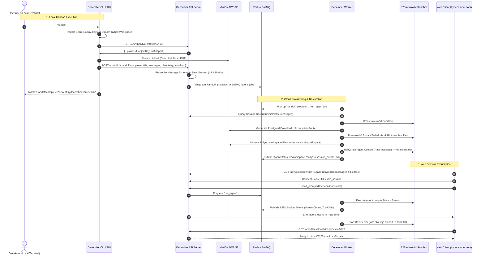

# Deep Technical Investigation & Primary-Source Code Audit: CLI-to-Cloud Session Migration (`/handoff`)

## Executive Summary

The `/handoff` feature in December allows a developer operating locally in the terminal via `@december/cli` (or `packages/tui`) to upload their current workspace files and conversational history to December Cloud (`trydecember.com`), enabling seamless continuation of the AI agent workflow in a remote E2B microVM cloud sandbox.

While foundational endpoints (`/cli/handoff/upload-url` and `/cli/handoff/complete`) and a basic CLI archive-and-upload routine exist, a deep primary-source audit revealed **critical architectural gaps and breaking bugs** that prevent `/handoff` from working end-to-end in production. Most notably:

1. **Broken Workspace Restoration in Worker (`minioPrefix` Key Mismatch)**: The CLI uploads the workspace tarball to `handoffs/${userId}/${timestamp}-handoff.tar.gz` and stores it in Prisma `Session.minioPrefix`. However, `E2BSandboxService.provisionSandbox` in `apps/worker` calls `restoreWorkspaceState` without querying `session.minioPrefix` or passing `objectKey`, which defaults to looking for `sessions/${sessionId}/workspace.tar.gz`. The S3 download returns 404, the error is swallowed, and the sandbox boots with an empty workspace.
2. **Buffer Overflow & Command Line Length Limit in E2B Extraction**: `restoreWorkspaceState` attempts to extract the tarball inside the E2B sandbox by running `echo "${base64Str}" | base64 -d > /tmp/restore.tar.gz`. For any repository larger than ~1–2 MB, this command exceeds Linux `ARG_MAX` and E2B command buffer limits, failing silently or crashing.
3. **Total Context Loss (Agent Memory Amnesia)**: `apps/worker` instantiates `new AgentHarness(...)` with only a system prompt; it never loads or rehydrates the past conversation messages stored in PostgreSQL (`prisma.message`) into `agent.conversation.messages`. The cloud agent starts with zero recollection of previous turns from the CLI.
4. **Message Schema Mismatch & Tool Role Corruption**: CLI messages contain rich tree metadata (`parentId`, `toolCalls`, `toolCallId`, `role: 'tool'`). Prisma's `enum MessageRole` only supports `USER`, `ASSISTANT`, `SYSTEM`. In `cli.repository.ts`, all `'tool'` role messages are coerced to `'USER'` role, and `toolCalls` / `blocks` are completely discarded.
5. **No Multipart Upload or Memory Streaming**: CLI `commands.tsx` loads the entire `.tar.gz` into RAM (`fs.readFileSync`) and issues a single HTTP PUT request. This causes OOM on large codebases (>100MB) and fails on unstable connections.
6. **Inadequate Secret Redaction**: The CLI excludes only `node_modules`, `.git`, and naive `.gitignore` lines. It does NOT exclude `.env`, `.env.*`, private keys (`.pem`, `.key`, `id_rsa`), `.aws`, `.ssh`, or sensitive local configuration files.
7. **Empty Web File Tree**: The web workspace file explorer reads S3 prefix `sessions/${sessionId}/workspace/`. Because the handoff tarball is not extracted to S3 object storage upon handoff completion, the web UI shows an empty file tree.

---

## 1. Current Implementation State Audit

### 1.1 CLI & TUI Layer (`packages/tui/src/components/command-menu/commands.tsx`)

- **Command Registration**: Registered in `COMMANDS` array at lines 87–189 under name `handoff` and value `/handoff`.
- **Execution Flow**:
    1. **Authentication Check** (lines 92–108): Checks `~/.config/december/config.json` for `config.decemberToken`. If missing, toasts `'You must be logged in to use handoff.'`.
    2. **Tarball Creation** (lines 110–144):
        - Sets `const archivePath = '.december-handoff.tar.gz'`.
        - Base excludes: `node_modules`, `.git`, `.december-handoff.tar.gz`.
        - Reads `.gitignore` and `.decemberignore` line-by-line with simple string trimming: `if (t && !t.startsWith('#')) excludes.push(`--exclude=${...}`)`.
        - Executes synchronous `execSync(\`tar -czf ${archivePath} ${excludeArgs} .\`, { stdio: 'ignore' })`.
    3. **Presigned URL Request** (lines 146–155):
        - Sends `GET ${proxyUrl}/cli/handoff/upload-url` with `Authorization: Bearer ${config.decemberToken}`.
        - Parses `{ uploadUrl, objectKey }` from `urlJson.data`.
    4. **Direct S3 Upload** (lines 156–163):
        - Reads entire archive into Node.js Buffer: `const fileData = fs.readFileSync(archivePath)`.
        - Sends single HTTP `PUT` to `uploadUrl` with `body: fileData`.
    5. **Handoff Finalization** (lines 165–179):
        - Sends `POST ${proxyUrl}/cli/handoff/complete` with payload:
            ```json
            {
              "title": "Handoff from <directory-basename>",
              "messages": ctx.agent ? ctx.agent.messages : [],
              "objectKey": objectKey
            }
            ```
    6. **Cleanup & Exit** (lines 181–185):
        - Deletes local `.december-handoff.tar.gz` via `fs.unlinkSync(archivePath)`.
        - Displays success toast and triggers `setTimeout(() => ctx.exit(), 3000)`.

### 1.2 Server Layer (`apps/server/src/modules/cli/`)

- **Routes (`cli.routes.ts`)**:
    - `GET /api/v1/cli/handoff/upload-url` -> `cliController.getHandoffUploadUrl` (protected by `authMiddleware` and `apiRateLimiter`).
    - `POST /api/v1/cli/handoff/complete` -> `cliController.completeHandoff`.
- **Controller (`cli.controller.ts`)**:
    - `getHandoffUploadUrl`: Extracts `userId = req.user?.userId`, calls `cliService.generateHandoffUrl({ userId })`, returns 200 with `{ uploadUrl, objectKey }`.
    - `completeHandoff`: Validates request body with `CompleteHandoffSchema.parse(req.body)`, calls `cliService.completeHandoff(...)`, returns 201 with created session record.
- **Service (`cli.service.ts`)**:
    - `generateHandoffUrl`:
        - Checks `cliRepository.findActiveSessionByUser(userId)` (lines 27–34). If a session is `RUNNING` or `PROVISIONING`, throws 409 Conflict.
        - Generates key `handoffs/${userId}/${Date.now()}-handoff.tar.gz`.
        - Creates S3 `PutObjectCommand` and signs with `getSignedUrl(s3, putCommand, { expiresIn: 3600 })`.
    - `completeHandoff`:
        - Calls `cliRepository.createSession({ userId, title, messages, minioPrefix: objectKey })`.
- **Repository (`cli.repository.ts`)**:
    - `createSession`:
        ```ts
        prisma.session.create({
            data: {
                userId,
                title,
                type: 'CLI',
                minioPrefix,
                messages: {
                    create: messages.map((msg: any, i: number) => ({
                        role:
                            msg.role === 'assistant'
                                ? 'ASSISTANT'
                                : msg.role === 'system'
                                  ? 'SYSTEM'
                                  : 'USER',
                        content:
                            typeof msg.content === 'string'
                                ? msg.content
                                : JSON.stringify(msg.content),
                        sequence: i,
                    })),
                },
            },
        })
        ```

### 1.3 Worker Layer (`apps/worker/src/`)

- **Worker Processing Loop (`index.ts`)**:
    - Listens to BullMQ queue `agent_jobs`.
    - On `run_agent` job:
        1. Sets `prisma.session.update({ where: { id: sessionId }, data: { vmStatus: 'PROVISIONING' } })`.
        2. Generates short-lived agent JWT token.
        3. Calls `E2BSandboxService.provisionSandbox({ sessionId, userId })`.
        4. Calls `E2BSandboxService.runAgentSession({ sessionId, sandboxId, prompt, workspaceDir: '/workspace', token, apiHostUrl })`.
        5. Pipes stream to `processGrpcStream(sessionId, stream)`.
- **Sandbox Lifecycle (`e2b-sandbox.service.ts`)**:
    - `provisionSandbox`:
        - Initializes E2B `Sandbox.create({ template: 'base', timeoutMs: 1800000 })`.
        - Calls `restoreWorkspaceState({ sessionId, workspaceDir: '/workspace', sandbox })`.
        - Note: `objectKey` is NOT passed to `restoreWorkspaceState`.
    - `runAgentSession`:
        - Creates `new RemotePlatformAdapter(effectiveSandboxId)`.
        - Creates `new AgentHarness({ llm, tools, operations: adapter, workspaceDir: '/workspace', sessionId })`.
        - Harness builds system prompt from skills and project rules.
        - Runs `for await (const event of runAgentLoop(agent, prompt))`.
- **Workspace State Management (`workspace.ts`)**:
    - `restoreWorkspaceState`:
        - S3 `GetObjectCommand` with `key = objectKey || \`sessions/${sessionId}/workspace.tar.gz\``.
        - Reads bytes into RAM: `const buffer = await response.Body.transformToByteArray()`.
        - Sends base64 string directly into shell command:
          `echo "${base64Str}" | base64 -d > /tmp/restore.tar.gz && mkdir -p /workspace && tar -xzf /tmp/restore.tar.gz -C /workspace && rm -f /tmp/restore.tar.gz`

### 1.4 Web App Integration (`apps/web/`)

- **Session Discovery**: `apps/web/src/features/sessions/api/session.ts` -> `getSessions()` queries `GET /api/v1/session`. Handed-off sessions appear with `type: 'CLI'`.
- **Session Rehydration**: `GET /api/v1/session/:id` (`session.service.ts -> getSession`):
    - Fetches `session` and `session.messages` from PostgreSQL.
    - Queries S3 prefix `sessions/${sessionId}/workspace/` via `loadSessionFiles({ sessionId })` to build `generatedFiles`.
- **Web Chat Connection**:
    - When user types in chat (`generation.ts -> runOverSocket`):
        - Connects to Socket.IO `/socket.io/`.
        - Emits `join_session` (`sessionId`).
        - Emits `send_prompt` with `{ sessionId, projectId, prompt }`.
        - Server `socket.ts` enqueues BullMQ job `run_agent` to `agent_jobs`.
        - Listens for `agent_event` (stream chunks, thinking chunks, tool calls, tool results, agent end).

---

## 2. Gaps, Vulnerabilities, and Root-Cause Analysis

### Gap 1: Workspace Tarball Key Mismatch (`minioPrefix` vs default key)

- **Primary Source Evidence**:
    - `apps/server/src/modules/cli/cli.service.ts:36`: Tarball uploaded to `handoffs/${userId}/${Date.now()}-handoff.tar.gz` and saved in `prisma.session.create({ minioPrefix })`.
    - `apps/worker/src/e2b-sandbox.service.ts:215`: `provisionSandbox` calls `restoreWorkspaceState({ sessionId, workspaceDir: '/workspace', sandbox })` without querying `session.minioPrefix` from DB and without passing `objectKey`.
    - `apps/worker/src/workspace.ts:114`: `restoreWorkspaceState` uses `const key = objectKey || \`sessions/${sessionId}/workspace.tar.gz\``.
- **Impact**: 100% of handed-off workspaces fail to restore. E2B sandbox initializes with an empty `/workspace`.

### Gap 2: Base64 String Injection over E2B Shell (`ARG_MAX` Crash)

- **Primary Source Evidence**:
    - `apps/worker/src/workspace.ts:129–134`:
        ```ts
        const base64Str = Buffer.from(buffer).toString('base64')
        await sandbox.commands.run(
            `echo "${base64Str}" | base64 -d > /tmp/restore.tar.gz && mkdir -p /workspace && tar -xzf /tmp/restore.tar.gz -C /workspace && rm -f /tmp/restore.tar.gz`,
            { cwd: '/workspace' }
        )
        ```
- **Impact**: Linux kernel `ARG_MAX` (typically 2MB on Linux) causes `E2BIG: Argument list too long`. Any repository larger than 1.5MB fails during extraction.

### Gap 3: Complete Loss of Conversational History (Agent Memory Amnesia)

- **Primary Source Evidence**:
    - `apps/worker/src/e2b-sandbox.service.ts:586–598`: `runAgentSession` creates a brand new `AgentHarness` and `Agent`.
    - `packages/agent/src/agent.ts:88–91`: `Agent` constructor only adds `{ role: 'system', content: this.systemPrompt }`.
    - `apps/worker/src/e2b-sandbox.service.ts:605`: `runAgentLoop(agent, prompt)` runs with no prior messages loaded from `prisma.message`.
- **Impact**: The cloud agent has zero memory of the CLI conversation, instructions given before handoff, or tool execution history.

### Gap 4: Message Tree Schema Mismatch & Role Destruction

- **Primary Source Evidence**:
    - `packages/shared/src/types.ts:18–24`: `AgentMessage` contains `id`, `parentId`, `role` (`'user' | 'assistant' | 'tool' | 'system'`), `toolCalls`, `toolCallId`.
    - `packages/database/prisma/schema.prisma:390–394`: `enum MessageRole { USER, ASSISTANT, SYSTEM }` (no `TOOL` role exists).
    - `apps/server/src/modules/cli/cli.repository.ts:14–24`:
        ```ts
        role: msg.role === 'assistant' ? 'ASSISTANT' : msg.role === 'system' ? 'SYSTEM' : 'USER'
        ```
- **Impact**: `tool` results are corrupted into `USER` messages. Assistant `toolCalls` and `blocks` are lost. The web UI displays unformatted tool output as user chat bubbles.

### Gap 5: No Multipart Upload or Memory Streaming for Large Repos

- **Primary Source Evidence**:
    - `packages/tui/src/components/command-menu/commands.tsx:141`: Synchronous `execSync('tar -czf ...')` blocks the single-threaded Node.js event loop and freezes the terminal UI.
    - `packages/tui/src/components/command-menu/commands.tsx:158`: `fs.readFileSync(archivePath)` buffers the entire tarball in Node memory.
    - `apps/server/src/modules/cli/cli.service.ts:38–43`: Presigned URL uses single `PutObjectCommand`. Single PUT is limited to 5GB maximum in S3 and is highly error-prone for payloads >50MB.
- **Impact**: High memory spikes, UI lockup during archiving, and failed uploads on moderate-to-large repositories.

### Gap 6: Sensitive Secrets & Credentials Leakage

- **Primary Source Evidence**:
    - `packages/tui/src/components/command-menu/commands.tsx:113–137`: Base exclude list only has `node_modules`, `.git`, `.december-handoff.tar.gz`.
    - `.gitignore` parsing only trims lines and skips `#`. It fails to handle negative rules (`!`), globs (`**/*.log`), or root slashes (`/build`).
    - `.env`, `.env.local`, `.env.production`, `id_rsa`, `.pem`, `.npmrc`, `.aws/credentials` are uploaded to S3 and E2B unless explicitly in `.gitignore`.
- **Impact**: High security risk of leaking developer API keys and cloud credentials to remote storage.

### Gap 7: Worker Job Queuing & Lifecycle

- **Primary Source Evidence**:
    - `apps/server/src/modules/cli/cli.service.ts:229`: `completeHandoff` only creates a database record. It does NOT enqueue a job to BullMQ queue `agent_jobs`.
    - `apps/server/src/modules/session/session.service.ts:37–77`: `loadSessionFiles` looks for individual files in `sessions/${sessionId}/workspace/`.
- **Impact**: The session sits idle. Web file tree is 100% empty until the first prompt is run and files are modified. There is no background unpacking or warm sandbox provisioning upon handoff.

### Gap 8: Dynamic Port Forwarding & Live Preview Lifecycle

- **Primary Source Evidence**:
    - `apps/server/src/modules/session/session.service.ts:476`: `proxyPreview` formats `targetHost = \`${port}-${session.vmId}.e2b.dev\``.
    - If the microVM is in `STOPPED` state, opening the web preview returns 502/404 because E2B is shut down and no dev server (e.g. Vite on 5173) is active.
- **Impact**: Web user clicking "Live Preview" immediately after handoff receives a broken preview link.

---

## 3. Comprehensive Architecture & Data Flow Blueprint



---

## 4. Step-by-Step Implementation Blueprint

### Step 1: Tarball Archiving & Secret Redaction (`packages/tui` & `packages/core`)

1. **Replace naive `.gitignore` parser** with standard `ignore` package (npm `ignore`).
2. **Add Strict Built-in Secret Blacklist**:
    ```ts
    const MANDATORY_EXCLUDES = [
        'node_modules/**',
        '.git/**',
        '.december-handoff.tar.gz',
        '.env',
        '.env.*',
        '*.pem',
        '*.key',
        '*.p12',
        '*.pfx',
        'id_rsa',
        'id_ed25519',
        '.aws/**',
        '.ssh/**',
        '.npmrc',
        '.pypirc',
        '.december/config.json',
        '*.log',
        '.next/**',
        'dist/**',
        'build/**',
    ]
    ```
3. **Asynchronous Archiving with Node `archiver` or `tar` stream**:
    - Stream directly to disk using `archiver('tar', { gzip: true })` without blocking the TUI event loop with `execSync`.
    - Provide progress callback for UI toast updates (`Zipping workspace (45%)...`).

### Step 2: S3 Upload & Multipart Support for Large Workspaces

1. **Server-Side Upload URL Dispatch (`apps/server/src/modules/cli/cli.service.ts`)**:
    - For files < 50MB: Provide standard single presigned `PutObjectCommand` URL.
    - For files > 50MB: Add endpoints for S3 multipart initialization (`CreateMultipartUploadCommand`), part signing (`UploadPartCommand`), and completion (`CompleteMultipartUploadCommand`).
2. **CLI Streaming Upload**:
    - Use `fs.createReadStream` piped to upload rather than `fs.readFileSync` into memory.

### Step 3: Message Tree Reconciliation (`apps/server` & `packages/database`)

1. **Map CLI `AgentMessage[]` to Prisma `Message` records accurately**:
    - Extract tool executions from CLI `tool` messages and embed them into the preceding assistant message's `blocks` JSON column:
        ```json
        {
            "type": "command",
            "toolCallId": "call_123",
            "toolName": "edit_file",
            "toolInput": { "targetFile": "src/index.ts" },
            "status": "success",
            "output": "File updated successfully"
        }
        ```
    - Convert conversational text into `{ type: "text", content: msg.content }` blocks.
    - Convert thinking logs into `{ type: "thinking", content: msg.thoughts }` blocks.
    - Store sequence numbers cleanly so the Web UI renders identical message bubbles.

### Step 4: Fix Worker Workspace Restoration (`apps/worker/src/`)

1. **Fix `minioPrefix` Resolution in `provisionSandbox` (`e2b-sandbox.service.ts`)**:
    - Query `prisma.session.findUnique({ where: { id: sessionId }, select: { minioPrefix: true } })`.
    - Pass `objectKey: sessionRecord.minioPrefix` to `restoreWorkspaceState`.
2. **Fix E2B Archive Extraction in `workspace.ts`**:
    - Replace `echo "${base64Str}" | base64 -d` with a presigned S3 download URL executed via `curl` directly inside the sandbox:
        ```ts
        const downloadUrl = await getSignedUrl(
            s3,
            new GetObjectCommand({ Bucket: bucket, Key: key }),
            { expiresIn: 900 }
        )
        await sandbox.commands.run(
            `curl -sSL "${downloadUrl}" -o /tmp/workspace.tar.gz && mkdir -p /workspace && tar -xzf /tmp/workspace.tar.gz -C /workspace && rm -f /tmp/workspace.tar.gz`,
            { cwd: '/workspace' }
        )
        ```
    - Or write buffer chunks using E2B Files API `await sandbox.files.write('/tmp/workspace.tar.gz', buffer)`.
3. **Unpack Workspace Files to S3 Prefix (`sessions/${sessionId}/workspace/`)**:
    - Ensure individual files are synced to S3 during initial restoration so `loadSessionFiles` immediately populates the Web file explorer.

### Step 5: Agent Context Rehydration (`apps/worker/src/e2b-sandbox.service.ts`)

1. **Rehydrate Past Messages in `runAgentSession`**:
    - Fetch all messages for `sessionId` from `prisma.message.findMany({ where: { sessionId }, orderBy: { sequence: 'asc' } })`.
    - Convert `prisma.message` records into `AgentMessage[]` format.
    - Initialize `agent.conversation = new ConversationManager(rehydratedMessages)`.
    - The agent now has full context of previous CLI prompts, code modifications, and errors.

### Step 6: Worker Auto-Provisioning & Web Preview Activation

1. **Enqueue Provisioning on Handoff Completion**:
    - In `cli.service.ts -> completeHandoff`, enqueue a background job to `agent_jobs` (`type: 'warm_provision'`) to unpack the workspace and warm up the sandbox before the user opens the web page.
2. **Auto-Detect & Launch Dev Server for Live Preview**:
    - Inspect `package.json` inside `/workspace`. If `scripts.dev` or `scripts.start` exists, optionally start the dev server in the background and publish the active E2B host URL via `E2BSandboxService.getPreviewUrl`.

---

## 5. Verification & Testing Plan

1. **Unit Tests**:
    - `packages/tui/test/unit/handoff.unit.test.ts`: Verify secret exclusion rules, `.gitignore` parsing, and multipart/single upload URL handling.
    - `apps/server/test/unit/cli.service.unit.test.ts`: Test `generateHandoffUrl`, `completeHandoff`, message block conversion, and `minioPrefix` storage.
    - `apps/worker/test/unit/workspace.unit.test.ts`: Test `restoreWorkspaceState` with custom `objectKey` and verify archive extraction using presigned curl/Files API.
2. **Integration & E2E Tests**:
    - `tests/e2e/cli-to-cloud-handoff.e2e.test.ts`:
        - CLI runs 2 local conversational turns with tool execution (`write_file`).
        - CLI executes `/handoff`.
        - Verify S3 tarball upload and DB session creation.
        - Worker picks up session, extracts tarball in mock/E2B sandbox.
        - Verify agent context has all 2 prior turns.
        - Web client sends 3rd turn via Socket.IO; agent references code created in turn 1.
        - Verify live preview endpoint resolves correctly.
