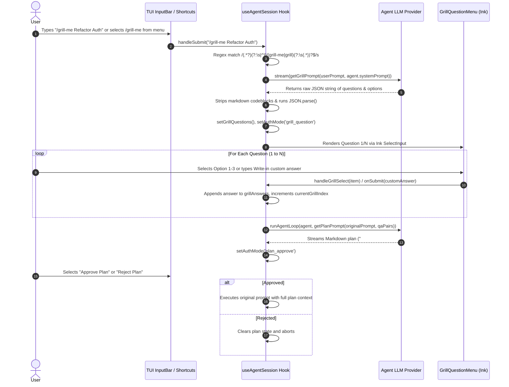
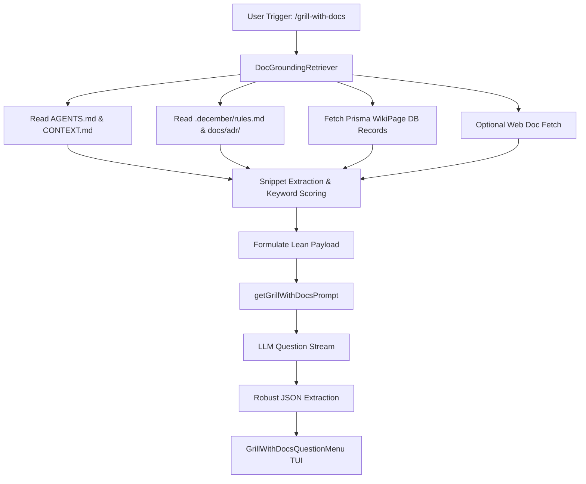

# Primary-Source Audit: `/grill-me` Command Implementation & `/grill-with-docs` Design Specification

**Repository:** `phasehumans/december`  
**Target File:** `docs/research/grill-me-cmd-audit.md`  
**Date:** July 31, 2026  
**Auditor:** Antigravity AI Subagent

---

## 1. Executive Summary & Scope

The `/grill-me` command in December is an interactive alignment tool designed to interview developers before executing complex code changes. Inspired by principal software architect design reviews, `/grill-me` uses an LLM to generate 5 to 8 targeted multiple-choice questions regarding architectural choices, API contracts, state management, and edge cases. Once answered by the user, the compiled responses feed into a secondary plan-generation loop to produce a structured `### Implementation Plan`.

This audit presents a primary-source, line-by-line code analysis of the `/grill-me` subsystem across the December CLI (`apps/cli`) and TUI (`packages/tui`). We trace its complete lifecycle, isolate technical vulnerabilities and UX shortcomings, and present a complete architectural design for an enhanced command: `/grill-with-docs`.

---

## 2. Source Code Audit & Flow Tracing

### 2.1 File Map & Component Responsibilities

| File Path                                                                                                                                                            | Primary Responsibility                                                                      | Key Symbols / Exports                                                                                                |
| :------------------------------------------------------------------------------------------------------------------------------------------------------------------- | :------------------------------------------------------------------------------------------ | :------------------------------------------------------------------------------------------------------------------- |
| [`apps/cli/src/constants/prompts.ts`](file:///home/chaitanya/code/december/apps/cli/src/constants/prompts.ts#L1-L37)                                                 | Formats LLM prompts for question generation & plan creation                                 | `getGrillPrompt()`, `getPlanPrompt()`                                                                                |
| [`apps/cli/src/features/chat/use-chat.ts`](file:///home/chaitanya/code/december/apps/cli/src/features/chat/use-chat.ts#L8-L45)                                       | Maintains React state hooks for grill interview state                                       | `grillMode`, `grillQuestions`, `grillAnswers`, `currentGrillIndex`, `grillPrompt`, `customInputMode`, `customAnswer` |
| [`apps/cli/src/hooks/use-agent-session.ts`](file:///home/chaitanya/code/december/apps/cli/src/hooks/use-agent-session.ts#L234-L357)                                  | Orchestrates LLM streaming, question parsing, state transitions & command submission        | `generateGrillQuestions()`, `generatePlanFromGrill()`, `handleGrillSelect()`, `handleSubmit()`                       |
| [`packages/tui/src/components/input-bar.tsx`](file:///home/chaitanya/code/december/packages/tui/src/components/input-bar.tsx#L89-L91)                                | Renders command input, manages command dropdown selection and `/grill-me` prefix state      | `InputBar`, backspace handler, command forwarder                                                                     |
| [`packages/tui/src/components/command-menu/commands.tsx`](file:///home/chaitanya/code/december/packages/tui/src/components/command-menu/commands.tsx#L71-L77)        | Defines `/grill-me` in the TUI command menu registry                                        | `COMMANDS` entry (`name: 'grill-me'`)                                                                                |
| [`packages/tui/src/components/menus/auth-menus.tsx`](file:///home/chaitanya/code/december/packages/tui/src/components/menus/auth-menus.tsx#L36-L37)                  | Renders active modal overlay menu based on `authMode`                                       | `AuthMenus` (`case 'grill_question'`)                                                                                |
| [`packages/tui/src/components/menus/grill-question-menu.tsx`](file:///home/chaitanya/code/december/packages/tui/src/components/menus/grill-question-menu.tsx#L7-L99) | Renders Ink interactive dropdown menu (`SelectInput`) and write-in text input (`TextInput`) | `GrillQuestionMenu`                                                                                                  |
| [`packages/tui/src/components/global-shortcuts.tsx`](file:///home/chaitanya/code/december/packages/tui/src/components/global-shortcuts.tsx#L75-L96)                  | Global keyboard listener for `Escape`, `Ctrl+C`, and navigation shortcuts                   | `useInput` hook handlers                                                                                             |

---

### 2.2 End-to-End Workflow Lifecycle

The diagram below maps out the exact state machine and data transformations executed during a `/grill-me` session:



---

### 2.3 Step-by-Step Stage Breakdown

#### Stage 1: Command Interception & Parsing

- **Location:** [`apps/cli/src/hooks/use-agent-session.ts:467-479`](file:///home/chaitanya/code/december/apps/cli/src/hooks/use-agent-session.ts#L467-L479)
- When a user submits text, `handleSubmit` evaluates it against regex:
    ```typescript
    const grillMatch = text.trim().match(/(.*?)(?:\s|^)\/(grill-me|grill)(?:\s(.*))?$/s)
    ```
- If matched:
    - Extract text before (`grillMatch[1]`) and after (`grillMatch[3]`) the command to construct `grillPromptText`.
    - If `grillPromptText.length > 0`, call `generateGrillQuestions(grillPromptText)`.
    - If `grillPromptText.length === 0` (user typed `/grill-me` with no args), toggle `grillMode = !grillMode`.

#### Stage 2: Prompt Formatting & LLM Question Generation

- **Locations:** [`apps/cli/src/constants/prompts.ts:1-24`](file:///home/chaitanya/code/december/apps/cli/src/constants/prompts.ts#L1-L24), [`apps/cli/src/hooks/use-agent-session.ts:252-265`](file:///home/chaitanya/code/december/apps/cli/src/hooks/use-agent-session.ts#L252-L265)
- Prompt helper `getGrillPrompt(userPrompt, agent.systemPrompt)` constructs a system architect instruction requesting 5-8 targeted multiple-choice questions with exactly 3 options each.
- `generateGrillQuestions` sets streaming UI state and calls `agent.llm.stream([{ role: 'user', content: prompt }])`.

#### Stage 3: JSON Parsing & Validation

- **Location:** [`apps/cli/src/hooks/use-agent-session.ts:267-276`](file:///home/chaitanya/code/december/apps/cli/src/hooks/use-agent-session.ts#L267-L276)
- Accumulates raw response chunks into `accumulatedText`.
- Strips outer triple backticks:
    ````typescript
    let cleanJson = accumulatedText.trim()
    if (cleanJson.startsWith('```')) {
        cleanJson = cleanJson.replace(/^```[a-zA-Z]*\n/, '').replace(/\n```$/, '')
    }
    ````
- Executes `JSON.parse(cleanJson)` and verifies `Array.isArray(questions) && questions.length > 0`.

#### Stage 4: TUI State Transition

- **Location:** [`apps/cli/src/hooks/use-agent-session.ts:278-284`](file:///home/chaitanya/code/december/apps/cli/src/hooks/use-agent-session.ts#L278-L284)
- Session hook updates CLI state:
    ```typescript
    setGrillQuestions(questions)
    setGrillPrompt(userPrompt)
    setGrillAnswers([])
    setCurrentGrillIndex(0)
    setAuthMode('grill_question')
    setCustomInputMode(false)
    ```
- `AuthMenus` ([`packages/tui/src/components/menus/auth-menus.tsx:36`](file:///home/chaitanya/code/december/packages/tui/src/components/menus/auth-menus.tsx#L36)) renders `GrillQuestionMenu`.

#### Stage 5: User Option Selection & Navigation

- **Locations:** [`packages/tui/src/components/menus/grill-question-menu.tsx:23-82`](file:///home/chaitanya/code/december/packages/tui/src/components/menus/grill-question-menu.tsx#L23-L82), [`apps/cli/src/hooks/use-agent-session.ts:340-357`](file:///home/chaitanya/code/december/apps/cli/src/hooks/use-agent-session.ts#L340-L357)
- Renders `SelectInput` with options 1 to 3, plus option `${N+1}. Write-in...`.
- If user selects "Write-in...", sets `customInputMode = true` and shows `TextInput`.
- Upon selection/write-in submission, appends answer to `grillAnswers`.
- If `currentGrillIndex + 1 < grillQuestions.length`, increments index; otherwise triggers `generatePlanFromGrill`.

#### Stage 6: Plan Generation & Approval

- **Location:** [`apps/cli/src/hooks/use-agent-session.ts:296-338`](file:///home/chaitanya/code/december/apps/cli/src/hooks/use-agent-session.ts#L296-L338)
- Invokes `getPlanPrompt(originalPrompt, qaPairs)` which formats questions and user answers.
- Runs `runAgentLoop(agent, planPrompt)` and streams output into chat.
- Sets `setAuthMode('plan_approve')` for final user confirmation.

---

## 3. Evaluation of Bugs, Edge Cases & UX Limitations

During our audit, we identified several critical bugs, state leakage issues, and design flaws across the `/grill-me` workflow:

### 3.1 Fragile JSON Parsing & Lack of Error Fallback

- **Vulnerability:** [`apps/cli/src/hooks/use-agent-session.ts:268-276`](file:///home/chaitanya/code/december/apps/cli/src/hooks/use-agent-session.ts#L268-L276)
- **Detail:** The markdown stripping regex (`replace(/^```[a-zA-Z]*\n/, '').replace(/\n```$/, '')`) assumes the model outputs _only_ a codeblock. If the LLM includes conversational preamble (e.g., _"Here are the questions for your task:"_) or postamble notes, `JSON.parse` throws a syntax error.
- **Impact:** Throws an exception caught at L286 (`addToast('Grill Failed: ...', 'error')`). The user receives a brief error toast, the streaming indicator clears, and all progress is lost without fallback.

### 3.2 State Leakage on Escape / Cancellation

- **Vulnerability:** [`packages/tui/src/components/global-shortcuts.tsx:80-96`](file:///home/chaitanya/code/december/packages/tui/src/components/global-shortcuts.tsx#L80-L96)
- **Detail:** There is a severe mismatch between `grillMode` (a boolean indicating if `/grill-me` is active as an input prefix) and `authMode === 'grill_question'`:

    ```typescript
    if (grillMode) {
        if (key.escape) {
            setGrillMode(false)
            setGrillQuestions([])
            setCurrentGrillIndex(0)
            setGrillAnswers([])
            setGrillPrompt(null)
        }
        return
    }

    if (authMode !== 'none') {
        if (key.escape && authMode !== 'login') {
            setAuthMode('none')
        }
        return
    }
    ```

    When `/grill-me <prompt>` is run, `authMode` becomes `'grill_question'`, but `grillMode` remains `false`. When the user presses `Escape`, line 92 triggers and resets `authMode` to `'none'`.

- **Impact:** The menu disappears, but `grillQuestions`, `grillPrompt`, `grillAnswers`, `currentGrillIndex`, and `customInputMode` remain populated in React memory. If `/grill-me` is triggered again later without explicit state clearing, stale interview data leaks into subsequent interactions.

### 3.3 Silent Trap in Custom Write-In Input

- **Vulnerability:** [`packages/tui/src/components/menus/grill-question-menu.tsx:66-69`](file:///home/chaitanya/code/december/packages/tui/src/components/menus/grill-question-menu.tsx#L66-L69)
- **Detail:** In `GrillQuestionMenu`, when `customInputMode` is active:
    ```typescript
    onSubmit={(value) => {
        const answer = value.trim()
        if (answer.length === 0) return
        ...
    ```
- **Impact:** If a user submits an empty string in the Write-in field (e.g. accidentally pressing Enter), the input handler silently returns `void`. The input field does not display an error message, nor does it let the user return to options. The user appears stuck.

### 3.4 Slash Command Parameter Erasure in Command Menu

- **Vulnerability:** [`packages/tui/src/components/input-bar.tsx:131-144`](file:///home/chaitanya/code/december/packages/tui/src/components/input-bar.tsx#L131-L144), [`packages/tui/src/components/command-menu/commands.tsx:71-77`](file:///home/chaitanya/code/december/packages/tui/src/components/command-menu/commands.tsx#L71-L77)
- **Detail:** If a user types `/grill-me Implement payment gateway` in the input bar and hits Enter while the command autocomplete menu is open, `InputBar.handleSubmit` resolves the command object and invokes `onSubmit(command.value)`.
- **Impact:** `command.value` is static (`'/grill-me'`). The user's custom arguments (`Implement payment gateway`) are erased and replaced with `/grill-me`, forcing the user into prefix mode rather than launching question generation directly.

### 3.5 System Prompt Token Waste

- **Vulnerability:** [`apps/cli/src/constants/prompts.ts:8`](file:///home/chaitanya/code/december/apps/cli/src/constants/prompts.ts#L8), [`apps/cli/src/hooks/use-agent-session.ts:252`](file:///home/chaitanya/code/december/apps/cli/src/hooks/use-agent-session.ts#L252)
- **Detail:** `getGrillPrompt` receives `agent.systemPrompt` as `projectContext`.
    ```typescript
    const prompt = getGrillPrompt(userPrompt, agent.systemPrompt)
    ```
    `agent.systemPrompt` (assembled in [`AgentHarness`](file:///home/chaitanya/code/december/packages/agent/src/harness/agent-harness.ts#L52-L70)) contains core operational guardrails, tool descriptions, terminal formatting rules, and system principles (often 2,000+ tokens).
- **Impact:** Passing tool definitions and system instructions as "project context" consumes unnecessary tokens on every question generation call and dilutes the LLM's focus on codebase architecture.

---

## 4. Design Specification for `/grill-with-docs`

To solve these deficiencies and provide grounded design alignment, we present the design for `/grill-with-docs`.

### 4.1 Concept & Objectives

`/grill-with-docs` extends `/grill-me` by grounding questions in real project documentation, repository rules (`AGENTS.md`, `CONTEXT.md`, `.december/rules.md`), project Wiki pages (Prisma `WikiPage`), and web documentation.

**Key Objectives:**

1. **Document-Grounded Questions:** Each generated question references specific file rules or design docs (e.g. _"According to AGENTS.md, service logic must use destructuring..."_).
2. **Resilient JSON Parsing:** Robust extraction of JSON payloads using regex boundary extraction (`/\[\s*\{.*\}\s*\]/s`).
3. **Enhanced TUI Menu:** Support for Back navigation (`Shift+Tab` / `Left Arrow`), explicit skip options, and clear state cleanup on Escape.
4. **Token Efficiency:** A dedicated `DocGroundingRetriever` that extracts relevant documentation snippets instead of dumping the full system prompt.

---

### 4.2 Document & Web Grounding Pipeline Architecture



---

### 4.3 Prompt Engineering Specification (`getGrillWithDocsPrompt`)

Add the following prompt generator to [`apps/cli/src/constants/prompts.ts`](file:///home/chaitanya/code/december/apps/cli/src/constants/prompts.ts):

```typescript
export const getGrillWithDocsPrompt = (
    userPrompt: string,
    docSnippets: { source: string; content: string }[],
    webSnippets?: { url: string; title: string; snippet: string }[]
) => `You are a principal software architect conducting a grounded specification review.

The user wants to implement: "${userPrompt}"

<project_documentation>
${docSnippets
    .map((doc) => `--- SOURCE: ${doc.source} ---\n${doc.content.slice(0, 1500)}\n`)
    .join('\n')}
</project_documentation>

${
    webSnippets && webSnippets.length > 0
        ? `<web_documentation>\n${webSnippets
              .map((w) => `--- URL: ${w.url} (${w.title}) ---\n${w.snippet}\n`)
              .join('\n')}</web_documentation>\n`
        : ''
}

Generate 5 to 8 targeted, high-impact multiple-choice questions to align on requirements.

Requirements:
1. GROUNDING: Every question MUST directly reference or cite architectural constraints from the provided project/web documentation.
2. CHOICE STRUCTURE: Each question MUST have exactly 3 distinct choices representing concrete technical tradeoffs.
3. CITATIONS: Include the document citation tag in the question text (e.g., "[AGENTS.md: Service Layer]").

Return output STRICTLY as a JSON array matching this schema:
[
  {
    "question": "Question text citing document?",
    "docSource": "AGENTS.md",
    "options": ["Option 1", "Option 2", "Option 3"]
  }
]

Return raw JSON only. Do not include markdown code block backticks.`
```

---

### 4.4 End-to-End Code Changes

#### 1. Command Registration in `commands.tsx`

Add `/grill-with-docs` to [`packages/tui/src/components/command-menu/commands.tsx`](file:///home/chaitanya/code/december/packages/tui/src/components/command-menu/commands.tsx#L77):

```typescript
{
    name: 'grill-with-docs',
    description: 'Interview me grounded in AGENTS.md, docs, and wiki context',
    value: '/grill-with-docs',
    action: (ctx) => {
        // Forwarded to chat handler
    },
},
```

#### 2. Robust JSON Extraction Helper

Create `extractJsonArray` utility in [`apps/cli/src/utils/json-parser.ts`](file:///home/chaitanya/code/december/apps/cli/src/utils/json-parser.ts):

````typescript
export function extractJsonArray(rawText: string): any[] {
    const trimmed = rawText.trim()
    // 1. Try direct parse
    try {
        const parsed = JSON.parse(trimmed)
        if (Array.isArray(parsed)) return parsed
    } catch {}

    // 2. Try codeblock extraction
    const codeblockMatch = trimmed.match(/```(?:json)?\s*([\s\S]*?)\s*```/)
    if (codeblockMatch) {
        try {
            const parsed = JSON.parse(codeblockMatch[1])
            if (Array.isArray(parsed)) return parsed
        } catch {}
    }

    // 3. Fallback bracket matching
    const bracketMatch = trimmed.match(/\[\s*\{[\s\S]*\}\s*\]/)
    if (bracketMatch) {
        try {
            const parsed = JSON.parse(bracketMatch[0])
            if (Array.isArray(parsed)) return parsed
        } catch {}
    }

    throw new Error('Could not extract a valid JSON array from LLM response.')
}
````

#### 3. Execution Handler in `use-agent-session.ts`

Implement `generateGrillWithDocsQuestions` in [`apps/cli/src/hooks/use-agent-session.ts`](file:///home/chaitanya/code/december/apps/cli/src/hooks/use-agent-session.ts):

```typescript
const generateGrillWithDocsQuestions = useCallback(
    async (userPrompt: string) => {
        setIsStreaming(true)
        setActiveMessages([
            {
                id: getNextMsgId(),
                role: 'assistant',
                blocks: [
                    {
                        type: 'text',
                        content: '*Gathering docs and generating grounded questions...*',
                    },
                ],
            },
        ])

        try {
            // Retrieve documentation snippets
            const docSnippets = await retrieveDocSnippets(process.cwd(), userPrompt)
            const prompt = getGrillWithDocsPrompt(userPrompt, docSnippets)

            const stream = agent.llm.stream([{ role: 'user', content: prompt }])
            let accumulatedText = ''
            for await (const chunk of stream) {
                if (chunk.type === 'text') accumulatedText += chunk.text
            }

            const questions = extractJsonArray(accumulatedText)

            setGrillQuestions(questions)
            setGrillPrompt(userPrompt)
            setGrillAnswers([])
            setCurrentGrillIndex(0)
            setAuthMode('grill_question')
            setActiveMessages([])
        } catch (err: any) {
            addToast(`Grill With Docs Failed: ${parseErrorMessage(err)}`, 'error')
        } finally {
            setIsStreaming(false)
        }
    },
    [agent]
)
```

#### 4. Clean Escape Cleanup in `global-shortcuts.tsx`

Update [`packages/tui/src/components/global-shortcuts.tsx:91-96`](file:///home/chaitanya/code/december/packages/tui/src/components/global-shortcuts.tsx#L91-L96) to clean state when `authMode === 'grill_question'`:

```typescript
if (authMode !== 'none') {
    if (key.escape && authMode !== 'login') {
        if (authMode === 'grill_question') {
            setGrillQuestions([])
            setCurrentGrillIndex(0)
            setGrillAnswers([])
            setGrillPrompt(null)
            setCustomInputMode(false)
        }
        setAuthMode('none')
    }
    return
}
```

---

## 5. Conclusion & Summary Matrix

| Audit Dimension          | Current `/grill-me` Status                        | Proposed `/grill-with-docs` Target                        |
| :----------------------- | :------------------------------------------------ | :-------------------------------------------------------- |
| **Context Source**       | Raw `agent.systemPrompt` (noisy, high-token)      | Grounded doc snippets (`AGENTS.md`, `CONTEXT.md`, Wiki)   |
| **JSON Resilience**      | Strict triple-backtick strip (fails on preambles) | Multi-stage regex bracket extractor + fallback            |
| **Escape Handler**       | Leaves stale grill state in memory                | Complete state purge on `Escape`                          |
| **TUI Options**          | Forward selection only, silent write-in trap      | Back navigation support (`Shift+Tab`), validated write-in |
| **Command Autocomplete** | Arguments stripped when selecting from menu       | Preserves user command arguments                          |

---

_Report compiled and saved to [`docs/research/grill-me-cmd-audit.md`](file:///home/chaitanya/code/december/docs/research/grill-me-cmd-audit.md)._
