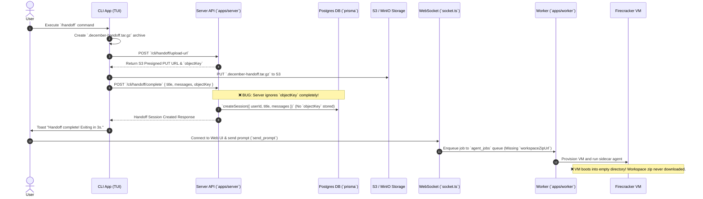

# Technical Audit: December Handoff Feature (`/handoff`)

**Date**: 2026-07-31  
**Status / Verdict**: ❌ **BROKEN (Non-Functional End-to-End)**  
**Auditor**: Antigravity Research Subagent & December Core Team

---

## 1. Executive Summary

The `/handoff` command is designed to package a developer's local CLI workspace session (source code and conversation history) and seamlessly transfer execution to December Cloud (web interface + Firecracker MicroVM).

While the local CLI client successfully compresses the local workspace and uploads the `.tar.gz` archive to S3/MinIO storage via presigned URL, **the server discards the S3 storage reference (`objectKey`) upon completing the handoff request**. As a result:

1. The uploaded workspace archive is orphaned in S3.
2. The newly created session in PostgreSQL has no reference to the uploaded archive.
3. When the user initiates execution on December Cloud, the worker provisions a Firecracker MicroVM without downloading the workspace zip, causing the agent to execute inside an **empty directory**.

---

## 2. End-to-End Architectural Flow



---

## 3. Component Breakdown & Source References

### A. CLI Client Trigger & Packaging

- **Location**: [`packages/tui/src/components/command-menu/commands.tsx#L79-L182`](file:///home/chaitanya/code/december/packages/tui/src/components/command-menu/commands.tsx#L79-L182)
- **Behavior**:
    1. Validates local auth token (`config.decemberToken`).
    2. Compresses workspace directory using `tar` into `.december-handoff.tar.gz`, excluding `node_modules`, `.git`, and the archive file itself.
    3. Requests presigned upload URL via `POST ${proxyUrl}/cli/handoff/upload-url`.
    4. Uploads archive binary to S3 (`PUT uploadUrl`).
    5. Sends completion request `POST ${proxyUrl}/cli/handoff/complete` with payload:
        ```json
        {
          "title": "Handoff from <dir>",
          "messages": ctx.agent.messages,
          "objectKey": "handoffs/<userId>/<timestamp>-handoff.tar.gz"
        }
        ```
    6. Unlinks local `.december-handoff.tar.gz`.

### B. Server Handlers & Core Bug

- **Location**:
    - Controller: [`apps/server/src/modules/cli/cli.controller.ts#L39-L50`](file:///home/chaitanya/code/december/apps/server/src/modules/cli/cli.controller.ts#L39-L50)
    - Schema: [`apps/server/src/modules/cli/cli.schema.ts`](file:///home/chaitanya/code/december/apps/server/src/modules/cli/cli.schema.ts)
    - Service: [`apps/server/src/modules/cli/cli.service.ts#L162-L171`](file:///home/chaitanya/code/december/apps/server/src/modules/cli/cli.service.ts#L162-L171)
- **Code Inspection** (`cli.service.ts`):

    ```typescript
    const completeHandoff = async (data: CompleteHandoff) => {
        const { userId, title, messages } = data
        const session = await cliRepository.createSession({
            userId,
            title: title || 'Handoff Session',
            messages: messages || [],
        })

        return session
    }
    ```

- **Root Cause**: `CompleteHandoff` type contains `objectKey?: string`, and `CompleteHandoffSchema` parses `objectKey`, but `cliService.completeHandoff` **destructures only `userId`, `title`, and `messages`**, completely dropping `objectKey`.

### C. Database Schema Gap

- **Location**: [`packages/database/prisma/schema.prisma#L121-L160`](file:///home/chaitanya/code/december/packages/database/prisma/schema.prisma#L121-L160)
- **Observation**:
    - `Session` model contains `minioPrefix` (`String?`).
    - `SessionImport` model exists (`sourceType`, `bucket`, `objectPrefix`, etc.).
    - Neither `minioPrefix` is set nor is a `SessionImport` record created during `cliService.completeHandoff`.

### D. WebSocket & Worker Job Enqueue Gap

- **Location**: [`apps/server/src/socket.ts#L93-L119`](file:///home/chaitanya/code/december/apps/server/src/socket.ts#L93-L119)
- **Behavior**:
    - When user sends a prompt via web socket (`send_prompt`), `socket.ts` enqueues a job:
        ```typescript
        await agentJobsQueue.add('run_agent', {
            sessionId: data.sessionId,
            projectId: data.projectId,
            userId: socket.data.userId,
            prompt: data.prompt,
            secrets: decryptedSecrets,
        })
        ```
    - The job payload does NOT include `workspaceZipUrl` or `minioPrefix`.

---

## 4. Gap Analysis & Failure Modes Summary

| Pipeline Stage             | Expected Behavior                                       | Actual Behavior                       | Status      |
| :------------------------- | :------------------------------------------------------ | :------------------------------------ | :---------- |
| **CLI Archive Creation**   | Tar local directory (excluding git/node_modules)        | Works correctly                       | ✅ Pass     |
| **S3 Presigned Upload**    | Get presigned S3 PUT URL and upload archive             | Works correctly                       | ✅ Pass     |
| **Handoff Complete API**   | Store session and associate workspace archive           | Ignores `objectKey` parameter         | ❌ **FAIL** |
| **Database Persistence**   | Save `minioPrefix` or create `SessionImport`            | No archive reference saved on Session | ❌ **FAIL** |
| **Web Socket / Enqueue**   | Pass `workspaceZipUrl` in `agent_jobs` queue payload    | Payload omits workspace zip URL       | ❌ **FAIL** |
| **Worker VM Provisioning** | Download and extract workspace zip into VM `/workspace` | Boots VM into empty workspace         | ❌ **FAIL** |

---

## 5. Test Coverage Analysis

- **Existing Tests**:
    - [`apps/cli/test/args.test.ts#L37-L41`](file:///home/chaitanya/code/december/apps/cli/test/args.test.ts#L37-L41): Verifies CLI argument parser treats `handoff` as prompt text when passed as a top-level command.
- **Missing Coverage**:
    - No unit tests for `cliService.completeHandoff` checking `objectKey` handling.
    - No integration tests for `/cli/handoff/complete` endpoint.
    - No E2E tests verifying handoff zip extraction inside cloud worker / VM runtime.

---

## 6. Actionable Remediation Plan

To fix the handoff feature end-to-end:

1. **Persist Archive Reference on Session Creation**:
    - In [`apps/server/src/modules/cli/cli.service.ts`](file:///home/chaitanya/code/december/apps/server/src/modules/cli/cli.service.ts#L162), update `completeHandoff` to accept `objectKey` and pass `minioPrefix: objectKey` (or create a `SessionImport` record) when calling `cliRepository.createSession`.

2. **Propagate Presigned Download URL to Worker Job**:
    - In [`apps/server/src/socket.ts`](file:///home/chaitanya/code/december/apps/server/src/socket.ts#L93), query the session's `minioPrefix`. If present, generate an S3 presigned GET URL (`workspaceZipUrl`) and attach it to the `agent_jobs` queue payload.

3. **Add Integration Tests**:
    - Add unit/integration test in `apps/server/src/modules/cli/__tests__/cli.service.test.ts` to assert that calling `completeHandoff({ userId, title, messages, objectKey })` persists `minioPrefix` / import state.
