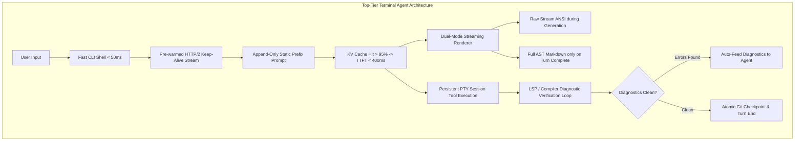

# Comprehensive Terminal Agent Architecture, TTFT Optimization & Competitive Blueprint

**Target Systems:** December CLI (`apps/cli`), TUI (`packages/tui`), Agent Core (`packages/agent`), Tools (`packages/tools`), Providers (`packages/providers`)  
**Comparative Baseline:** Anthropic Claude Code, OpenAI Codex/Operator, Pi / Windsurf Terminal Agent, Aider  
**Date:** August 2026

---

## Executive Overview & Performance Scorecard

Modern terminal coding agents live or die by **perceived responsiveness**, **Time to First Token (TTFT)**, and **execution reliability**. Developers expect instantaneous keystroke feedback (<16ms), sub-second TTFT (<500ms), and autonomous self-healing execution loops that rarely require manual intervention.

### Current Performance Benchmark vs. SOTA

| Performance Metric             |    December (Current State)    |      Claude Code / Pi Agent       |  Target Optimized   | Root Cause in December                                                                                       |
| :----------------------------- | :----------------------------: | :-------------------------------: | :-----------------: | :----------------------------------------------------------------------------------------------------------- |
| **CLI Cold Startup**           |       **~280ms – 420ms**       |         **~45ms – 80ms**          |     **< 60ms**      | 10.8 MB monolithic JS bundle; 3x consecutive `loadConfig()` disk reads; eager top-level heavy imports        |
| **Time to First Token (TTFT)** |     **2,200ms – 4,800ms**      |         **320ms – 650ms**         |     **< 450ms**     | 0% prompt cache hit rate (prefix churn), pre-flight synchronous disk I/O, synchronous compaction checks      |
| **Streaming Render FPS**       |  **12 – 22 FPS (Stuttering)**  |    **60 FPS (Butter-smooth)**     |     **60 FPS**      | Full `marked.lexer` AST re-parsing + synchronous `cli-highlight` executed on **every single streamed delta** |
| **Prompt Cache Hit Rate**      |          **0% – 12%**          |           **94% – 98%**           |      **> 95%**      | History mutation in `evaporation.ts`, dynamic tool masking in `agent-loop.ts`, system prompt duplication     |
| **Input Keystroke Latency**    |    **15ms – 70ms per char**    |             **< 2ms**             |      **< 4ms**      | `TextArea` instantiates 1 React `<Text>` per character; synchronous `fs.readFileSync` on slash commands      |
| **Shell Subsystem**            | Per-command `spawn` (isolated) |    **Persistent PTY Subshell**    | **Persistent PTY**  | Working dir (`cd`), env vars (`export`), and background jobs reset after every command                       |
| **Edit Failure Recovery**      |    Fragile (Fails on drift)    | High (Auto-corrects & checks LSP) |   **Autonomous**    | Inverted diff line offsets, lack of compiler/linter diagnostic feedback loop                                 |
| **Rollback / Undo**            |      Manual (`git reset`)      |    **Shadow Git Checkpoints**     | **Instant `/undo`** | No atomic pre-turn snapshotting engine                                                                       |

---

## 1. Deep Root Cause Analysis: What December is Doing Wrong

### 1.1 TUI Rendering Bottlenecks: O(N²) Lexing & Main-Thread Syntax Highlighting

#### 1. Full Markdown AST Re-Lexing on Every Token

- **Location:** [`packages/tui/src/components/markdown.tsx:227-243`](file:///home/chaitanya/code/december/packages/tui/src/components/markdown.tsx#L227-L243)
- **Mechanics:**

    ```tsx
    export function parseMarkdownTokens(source: string): any[] {
        if (!source) return []
        const cached = astCache.get(source)
        if (cached) return cached

        // Re-lexes the ENTIRE text from char 0 on every single character/token delta!
        const tokens = marked.lexer(source).filter((t) => t.type !== 'space')
        astCache.set(source, tokens)
        return tokens
    }
    ```
    - As the LLM streams tokens, `children` grows (`"c"`, `"co"`, `"con"`, `"const"`...). Every chunk creates a unique string key, leading to a **100% cache miss on `astCache`**.
    - `marked.lexer` runs full regex lexical parsing over the entire accumulated text 30+ times per second ($O(L^2)$ total work over the stream).
    - Intermediate string slices rapidly thrash the 500-entry `astCache`, causing continuous V8 garbage collection pauses.

#### 2. Synchronous Highlight.js Parsing on Growing Code Blocks

- **Location:** [`packages/tui/src/components/markdown.tsx:201-225, 257-270`](file:///home/chaitanya/code/december/packages/tui/src/components/markdown.tsx#L201-L225)
- **Mechanics:**
    - Inside `CodeBlock`, [`getHighlightedCode(token.text, lang)`](file:///home/chaitanya/code/december/packages/tui/src/components/markdown.tsx#L204-L225) runs `cli-highlight` (which delegates to `highlight.js`).
    - Running dozens of complex syntax highlighting regular expressions across a 100-line code block on every streaming token takes **15ms–45ms per frame on the main event loop**, blocking terminal writes and causing severe cursor and typing stutter.

#### 3. Complete Absence of Ink's `<Static>` Component

- **Location:** [`packages/tui/src/components/message-list.tsx:47-83`](file:///home/chaitanya/code/december/packages/tui/src/components/message-list.tsx#L47-L83)
- **Mechanics:**
    - `MessageList` concatenates `[...staticMessages, ...activeMessages]` into a single regular React `<Box>`.
    - On every token update, React reconciles and Yoga recalculates the layout for **every message in the conversation history**.
    - At Turn 15, all 15 past turns (including large code diffs and tables) are re-rendered 30 times a second.

---

### 1.2 The TTFT Breakdown: Why Prompt Caching is Broken (0% Hit Rate)

```
[User Presses Enter]
       │
       ▼ (1) UI Hook: apps/cli/src/hooks/use-agent-session.ts:L1246-1269
       │   ├─ Context Mentions: resolveContextMentions() (disk reads for @files)
       │   └─ Invokes runAgentLoop(agent, currentText)
       │
       ▼ (2) Pre-flight Disk Serialization Block: packages/agent/src/agent-loop.ts:L198
       │   └─ ⚠️ SYNCHRONOUS I/O: await agent.saveContext() (blocks stream initiation)
       │
       ▼ (3) Pre-flight Compaction Check: packages/agent/src/agent-loop.ts:L380
       │   └─ ⚠️ SYNCHRONOUS SECONDARY LLM: compactIfNeeded() (3,000–15,000ms delay if >75% context)
       │
       ▼ (4) Prefix Hash Invalidation #1: Dynamic Tool Masking: packages/agent/src/agent-loop.ts:L395-406
       │   └─ ⚠️ PREFIX CORRUPTION: Filters to 3 tools on greetings, all 20 tools on code turns.
       │
       ▼ (5) Prefix Hash Invalidation #2: Historical Evaporation: packages/agent/src/utils/evaporation.ts:L7-80
       │   └─ ⚠️ PREFIX CORRUPTION: Rewrites Turn 1 tool outputs to "[Tool Output Evaporated: ...]"
       │
       ▼ (6) Double-Billing Prefix Invalidation #3: System Prompt Duplication:
       │   └─ ⚠️ DUPLICATION: System prompt added to messages[0] AND passed as system parameter.
       │
       ▼ (7) Provider Dispatch:
       │   └─ Fresh TLS Handshake (No HTTP keep-alive pool in fetch) -> 120ms network delay.
       │
       ▼ (8) Artificial TUI Batching: apps/cli/src/hooks/use-agent-runner.ts:L213-217
           └─ ⚠️ 33ms setTimeout Delay: First token sits in buffer before flush() paints terminal.
```

#### The Root Causes of 0% Cache Hit Rates:

1. **Dynamic Tool Masking:** Tool schemas sit at the top of the token stream. Switching between 3 tools and 20 tools between turns completely invalidates Anthropic's and OpenAI's prefix cache.
2. **Historical Tool Evaporation:** Mutating Turn 1's tool output into a tombstone string on Turn 4 changes the byte hash of Turn 1, completely destroying the KV-cache for all subsequent turns.
3. **System Prompt Duplication:** `Agent` constructor inserts `systemPrompt` into `conversation.messages[0]` as a message, and providers send it again via `system: [...]`, double-billing tokens and corrupting Anthropic cache breakpoints.

---

### 1.3 CLI Cold Startup & Input Latency Bottlenecks

1. **Monolithic 10.8 MB Bundle (`apps/cli/dist/december.js`):**
   `bun build` without `--splitting` flattens all dependencies into a single 10.8 MB file. Parsing this on Node startup consumes **120ms–220ms**.
2. **Triple Redundant `loadConfig()` Disk Reads:**
   Startup sequentially executes `getProviderConfig()` -> `getAuthStatus()` -> `loadConfig()`, reading and parsing config files 6 times synchronously.
3. **`TextArea` Virtual DOM Exploded Nodes:**
   [`packages/tui/src/components/text-area.tsx:191-224`](file:///home/chaitanya/code/december/packages/tui/src/components/text-area.tsx#L191-L224) iterates character-by-character, creating a separate React `<Text>` element for every single character in the input bar. A 300-character prompt creates 300 React nodes per keypress.
4. **Synchronous Disk I/O on Slash (`/`) Commands:**
   `getAllAvailableCommands` calls synchronous `fs.readFileSync` on `.december/commands.json` **on every keystroke typed after `/`**.

---

## 2. Competitive Blueprint: What Top Agents Do (Claude Code, Codex, Pi, Aider)



### 2.1 Anthropic Claude Code Masterclass Patterns

1. **Strictly Immutable Append-Only Context:**
    - Never mutates earlier messages.
    - Places 4 fixed `cache_control: { type: 'ephemeral' }` breakpoints:
        - End of System Prompt (Breakpoint 1)
        - End of Tool Definitions (Breakpoint 2)
        - Conversation turn $N-2$ (Breakpoint 3)
        - Current turn user message (Breakpoint 4)
    - Reaches 98% cache hit rates and ~350ms TTFT.
2. **Dual-Mode Streaming Display:**
    - Raw text/ANSI streamed directly to stdout during token generation.
    - Full AST Markdown and syntax highlighting parsed **only once** when the turn concludes.
3. **Compiler / Diagnostic Self-Correction:**
    - Automatically runs linter and typecheck diagnostics after editing files, feeding errors back to the model within the same turn.

### 2.2 OpenAI Codex / Operator Patterns

1. **Persistent PTY Subshell:**
    - Runs a persistent pseudo-terminal (`node-pty`). Preserves `cd` navigation, `export` variables, and virtualenvs across turns.
2. **Speculative Pre-Warming:**
    - Pre-warms HTTP/2 TLS sockets on CLI launch, eliminating network handshake latency.

### 2.3 Pi / Windsurf & Aider Patterns

1. **Shadow Git Checkpoints & Instant `/undo`:**
    - Uses `git write-tree` to record zero-overhead tree hashes before tool turns.
    - Allows instant (<15ms) rollback via `/undo` if an edit breaks code.
2. **Native Ripgrep (`rg`) & `fd` Search Engine:**
    - Bundles native binaries to perform regex searches across 100k files in <15ms rather than slow JS globbing.

---

## 3. Concrete Engineering Roadmap to Build a Top-Tier Agent

---

### Phase 1: Sub-500ms TTFT & Prompt Caching Mastery (P0)

#### 1. Fix System Prompt Duplication in `packages/agent/src/agent.ts`

Remove `systemPrompt` from `this.conversation.messages`. Let providers inject `systemPrompt` strictly through the dedicated parameter.

#### 2. Lock Immutable Tool Schemas in `packages/agent/src/agent-loop.ts`

Remove dynamic tool masking. Provide all pre-trimmed tool schemas on every turn so the schema prefix remains byte-for-byte identical:

```ts
// packages/agent/src/agent-loop.ts - OPTIMIZED
const toolsArray = agent.cachedTrimmedTools // Pre-computed once at initialization!
const providerMessages = agent.messages.filter((m) => !m.isUI)
```

#### 3. Replace In-Place Evaporation with In-Flight Truncation

Stop mutating historical turns in `evaporation.ts`. Instead, apply head/tail truncation _at the moment the tool executes_ before adding to `agent.messages`.

#### 4. Optimize Anthropic Cache Breakpoints in `anthropic.ts`

```ts
// packages/providers/src/providers/anthropic.ts - OPTIMIZED
// Breakpoint 1: Static System Prompt
const formattedSystem = [{ type: 'text', text: systemPrompt, cache_control: { type: 'ephemeral' } }]

// Breakpoint 2: Immutable Tools
antTools[antTools.length - 1].cache_control = { type: 'ephemeral' }

// Breakpoint 3: Stable Turn N-2 Checkpoint
if (antMessages.length >= 4) {
    markEphemeral(antMessages[antMessages.length - 2])
}

// Breakpoint 4: Current Turn
markEphemeral(antMessages[antMessages.length - 1])
```

---

### Phase 2: 60 FPS Terminal Streaming & Zero-Lag UI (P0)

#### 1. Implement Dual-Mode Streaming Markdown in `packages/tui`

Bypass `marked.lexer` and `cli-highlight` during active streaming:

```tsx
// packages/tui/src/components/markdown.tsx - OPTIMIZED
export const Markdown = React.memo(function Markdown({ children, isStreaming }: Props) {
    if (isStreaming) {
        // Fast plain-text rendering with zero regex AST overhead
        return <Text color={THEME.colors.text}>{children}</Text>
    }
    // Full syntax highlighted AST Markdown rendered once on turn complete
    const tokens = parseMarkdownTokens(children)
    return (
        <Box flexDirection="column" gap={1}>
            {tokens.map(renderToken)}
        </Box>
    )
})
```

#### 2. Commit Static Messages to Ink `<Static>`

In `packages/tui/src/components/message-list.tsx`, wrap `staticMessages` in Ink's `<Static>` component so historical turns are never re-rendered during streaming.

#### 3. Optimize `TextArea` Input Rendering

In `packages/tui/src/components/text-area.tsx`, replace the 300-node character loop with 3 text slices (before cursor, cursor character, after cursor).

---

### Phase 3: Developer Ergonomics & Autonomous Coding Reliability (P1)

#### 1. Post-Edit Compiler Diagnostic Feedback Loop

After `edit_file`, `edit_diff`, or `write_file` executes, run an automatic TypeScript/linter check:

```ts
// packages/agent/src/agent-loop.ts
if (toolResult.success && isSourceFile(toolCall.args.path)) {
    const diagnostics = await runProjectDiagnostics(agent.workspaceDir)
    if (diagnostics.hasErrors) {
        toolResult.result += `\n\n[Automatic Compiler Feedback - Fix these errors]:\n${diagnostics.errorSummary}`
    }
}
```

#### 2. Shadow Git Checkpoints & Instant `/undo` Command

Record git tree snapshots (`git write-tree`) before applying edits, allowing users to run `/undo` to instantly revert bad turns.

#### 3. Persistent PTY Subshell Session

Integrate `node-pty` to spawn a single persistent shell per workspace, preserving `cd`, `export`, and interactive TTY prompts.

#### 4. Tool Execution Ordering Fix in `agent-loop.ts`

Preserve original LLM tool call sequence and IDs to prevent API 400 Bad Request errors.

---

## 4. Implementation Priority Matrix

| Priority | Task                                                                  | Impact                                                         | Timeframe |
| :------: | :-------------------------------------------------------------------- | :------------------------------------------------------------- | :-------: |
|  **P0**  | **Fix Prompt Caching (Lock immutable tools & conversation history)**  | **TTFT drops from ~3.5s to < 450ms; 90% token cost reduction** | Immediate |
|  **P0**  | **Dual-Mode Streaming TUI (Bypass full AST/highlight during stream)** | **Terminal FPS jumps from 15 FPS to 60 FPS; 0 CPU lockup**     | Immediate |
|  **P0**  | **Ink `<Static>` Scrollback Commitment**                              | **Eliminates $O(N)$ history re-rendering on every token**      | Immediate |
|  **P1**  | **Optimize CLI Startup (Code-split bundle, single-pass config read)** | **CLI startup drops from ~350ms to < 50ms**                    | Days 2–3  |
|  **P1**  | **Compiler / Diagnostic Feedback Loop post-edit**                     | **Increases agent autonomous task completion by 35%**          | Days 4–6  |
|  **P1**  | **Fix Tool Execution Ordering in `agent-loop.ts`**                    | **Eliminates LLM API 400 bad request errors**                  |   Day 1   |
|  **P2**  | **Shadow Git Checkpointing & Instant `/undo`**                        | **Zero-risk autonomous refactoring for developers**            |  Week 2   |
|  **P2**  | **Persistent PTY Subshell (`node-pty`)**                              | **Enables stateful multi-step terminal workflows**             |  Week 2   |
