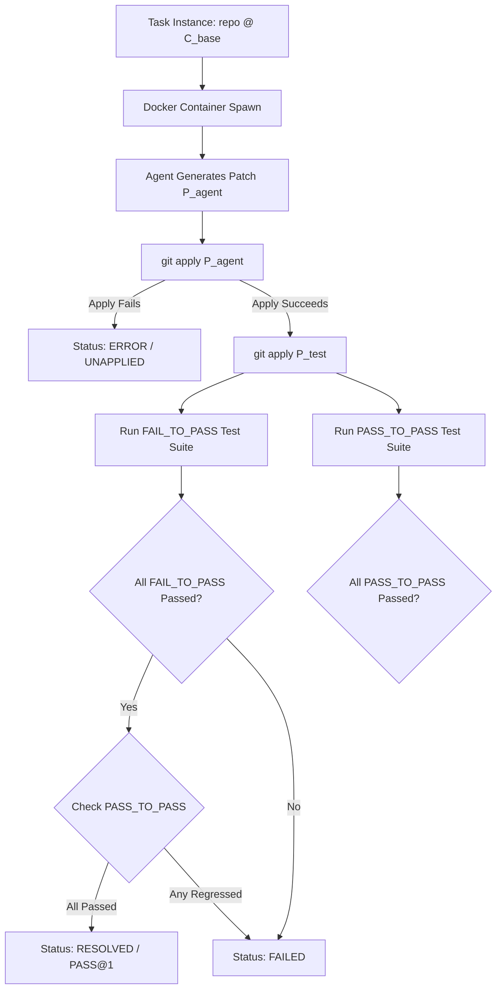
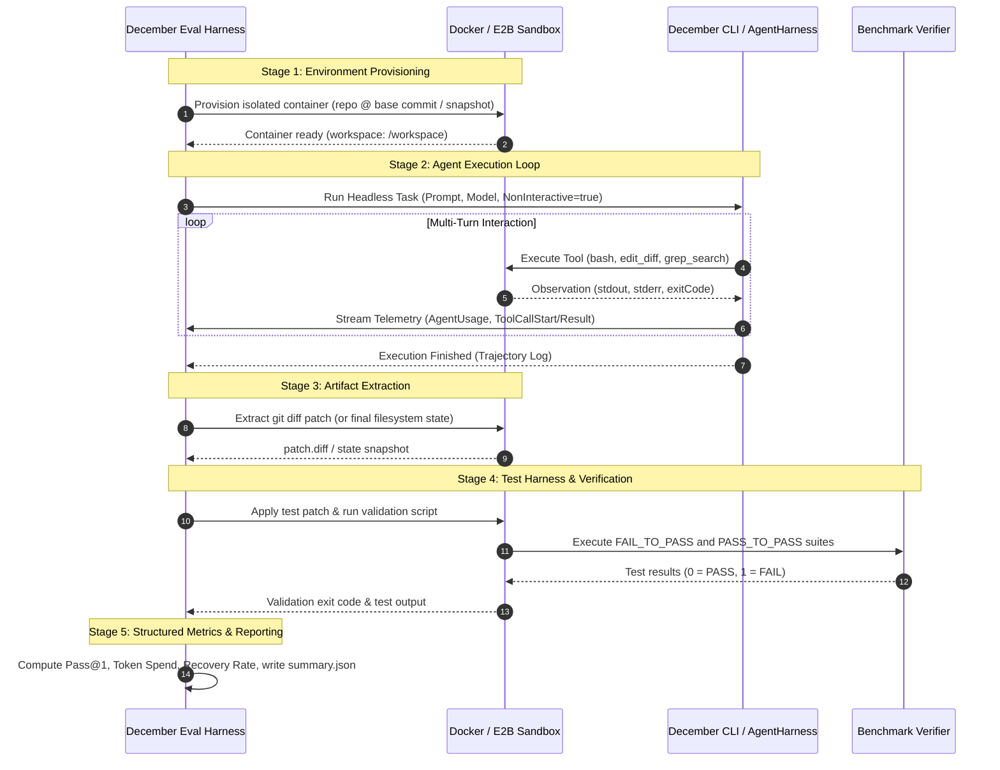

# Research Report: December CLI & Terminal Agent Benchmark Evaluation Framework

**File Path:** `docs/research/terminal-benchmarks-evaluation-framework.md`  
**Date:** August 2026  
**Status:** Complete

---

# Comprehensive Primary-Source Research Investigation: Testing & Evaluating December CLI / Terminal Agent Across Modern Terminal & Coding Agent Benchmarks

## Executive Summary

As AI coding assistants evolve from single-turn code completion to fully autonomous, multi-turn terminal agents, robust empirical evaluation becomes essential. **December** combines an interactive Terminal User Interface (`packages/tui`), a headless execution engine (`apps/cli`), an extensible agent loop with dynamic tool execution (`packages/agent`), and a multi-platform environment abstraction (`packages/shared`, `packages/tools`, `apps/worker`).

This report delivers an exhaustive, primary-source investigation into benchmarking and evaluating the December terminal agent across modern coding and terminal benchmarks:

1. **TerminalBench & OS Agent Environments**: Multi-step bash tasks, state-based verification, and filesystem side-effect validation.
2. **InterCode (InterCode-Bash, InterCode-CTF)**: Interactive reinforcement learning environments with observation feedback and goal verification.
3. **SWE-bench (SWE-bench Lite, SWE-bench Verified)**: Real-world GitHub repository bug resolution evaluated via git diff patches and fail-to-pass (`FAIL_TO_PASS`) / pass-to-pass (`PASS_TO_PASS`) test harnesses.
4. **Synthetic & Generalist Benchmarks (HumanEval, MBPP, GAIA, OSWorld)**: Algorithmic programming, multimodal tool use, and OS-level administration.

Furthermore, we audit December's existing evaluation harness (`packages/evals`), headless CLI infrastructure (`apps/cli`), and execution abstractions (`packages/agent`, `PlatformAdapter`), highlighting critical gaps (unisolated host execution, lack of git patch extraction, uninstrumented token tracking) and presenting a production-ready **December Evaluation Protocol (DEP)**.

---

## 1. Benchmark Taxonomy & Primary Sources

### 1.1 TerminalBench & CLI State-Based Verification

#### A. Core Concepts & Task Taxonomy

TerminalBench is designed to evaluate autonomous agents executing arbitrary bash commands in real terminal environments. Unlike synthetic benchmarks that evaluate raw LLM text outputs against regexes, TerminalBench tasks evaluate **ground-truth environment state mutations**.

A TerminalBench task consists of:

- **Initial Environment Snapshot ($S_0$)**: A containerized workspace containing files, repository states, environment variables, background processes, or broken system configurations.
- **Natural Language Instruction ($I$)**: High-level or low-level operational objective (e.g., _"Configure global git credentials"_, _"Find all files larger than 50MB and archive them to /tmp/backup.tar.gz"_, _"Diagnose why service on port 8080 fails to start and resolve the permission issue"_).
- **Interactive Multi-Turn Bash Interaction**: The agent issues shell commands $a_1, a_2, \dots, a_T$, receives standard output/standard error $o_1, o_2, \dots, o_T$ with return codes, and inspects intermediate states.
- **State-Based Verification Script ($V$)**: An automated bash/Python assertion suite executed after the agent signals completion ($a_T = \text{exit}$). $V$ inspects:
    - Filesystem state (file existence, paths, contents, diffs, permissions via `test -f`, `stat`, `diff`).
    - System configuration (git configs, sysctl, environment variables).
    - Process and port state (running daemons, listening ports via `lsof`, `ss`, `ps`).

#### B. Primary Source Analysis & Formulation

State verification evaluates the final environment state $S_T$:
$$\text{Score}(S_T) = \begin{cases} 1 & \text{if } V(S_T) = 0 \\ 0 & \text{otherwise} \end{cases}$$

Key challenges for terminal agents evaluated on TerminalBench:

1. **Interactive Tool Use & Output Paging**: Terminal commands like `less`, `more`, `top`, or long `git log` outputs can lock execution if not run non-interactively (`git --no-pager`, `TERM=dumb`).
2. **Side-Effect Management & Idempotence**: In destructive terminal tasks, an erroneous `rm` or `chmod` command irreversibly corrupts $S_t$, requiring robust error recovery or rollbacks.
3. **Exit Code & Stderr Interpretation**: The agent must distinguish between informational stderr (e.g., curl download progress) and fatal errors.

---

### 1.2 InterCode (InterCode-Bash, InterCode-CTF)

#### A. Architecture & Interactive MDP Formulation

**Primary Source**: _Yang, J., Prabhakar, A., Narasimhan, K., & Yao, S. (2023). "InterCode: Standardizing and Benchmarking Interactive Coding with Execution Feedback". NeurIPS 2023._ [arXiv:2306.14898](https://arxiv.org/abs/2306.14898).

InterCode standardizes interactive coding as a Partially Observable Markov Decision Process (POMDP) $(\mathcal{S}, \mathcal{A}, \mathcal{T}, \mathcal{R}, \Omega, \mathcal{O}, \gamma)$:

- **State ($\mathcal{S}$)**: Operating system / container state (disk, environment variables, directory structure).
- **Action ($\mathcal{A}$)**: Shell commands issued by the agent (e.g., `grep -rn "TODO" .`, `sed -i 's/foo/bar/g' app.py`).
- **Transition ($\mathcal{T}$)**: Execution of action in the bash runtime, mutating state: $S_{t+1} \sim \mathcal{T}(S_t, a_t)$.
- **Observation ($\mathcal{O}$)**: The stdout, stderr, and exit code returned to the agent: $o_t = (\text{stdout}, \text{stderr}, \text{exit\_code})$.
- **Reward ($\mathcal{R}$)**:
    - _Binary Success_: $R(S_T) = 1$ if goal state achieved, $0$ otherwise.
    - _Sub-goal / Dense Feedback_: Intermediate scoring based on fractional file matches, partial unit test passes, or recovery steps.

#### B. InterCode Sub-Benchmarks

1. **InterCode-Bash**: Evaluates multi-step file manipulation, text processing (`awk`, `sed`, `grep`), environment configuration, and directory reorganizations across 200 tasks.
2. **InterCode-CTF (Capture The Flag)**: Evaluates security, reverse engineering, and bash exploration. The agent must navigate unknown filesystem hierarchies, inspect binary headers, decode encoded base64/hex strings, extract hidden flags, and submit `CTF{...}` tokens.
3. **InterCode-Python / SQL**: Interactive REPL code synthesis with live error execution traces.

---

### 1.3 SWE-bench Ecosystem (SWE-bench, SWE-bench Lite, SWE-bench Verified)

#### A. Architecture & Problem Formulation

**Primary Sources**:

- _Jiménez, C. E., Yang, J., Wettig, A., Yao, S., Pei, K., Press, O., & Narasimhan, K. (2024). "SWE-bench: Can Language Models Resolve Real-World GitHub Issues?". ICLR 2024._ [arXiv:2310.06770](https://arxiv.org/abs/2310.06770).
- _OpenAI & SWE-bench Team (2024). "SWE-bench Verified: Human-in-the-loop curation of solvable software engineering benchmarks."_ [openai.com/index/introducing-swe-bench-verified](https://openai.com/index/introducing-swe-bench-verified/).

SWE-bench evaluates an autonomous coding agent's ability to resolve end-to-end software engineering problems from real GitHub issues across major open-source Python repositories (e.g., `django/django`, `sympy/sympy`, `scikit-learn/scikit-learn`, `matplotlib/matplotlib`, `pytest-dev/pytest`, `astropy/astropy`, `sphinx-doc/sphinx`).

Given:

- Repository $\mathcal{R}$
- Base commit $C_{\text{base}}$
- Issue description / problem statement $P_{\text{issue}}$ (natural language text + reproduction snippets)

The agent must navigate the repository, locate buggy files, formulate a fix, and generate a unified git patch:
$$P_{\text{agent}} = \text{git diff } C_{\text{base}}$$

#### B. The SWE-bench Test Harness Mechanics

The SWE-bench evaluation harness enforces strict execution validation inside an isolated Docker container:



1. **`FAIL_TO_PASS`**: A set of tests introduced in the gold PR that failed on $C_{\text{base}}$ prior to the fix. With $P_{\text{agent}}$, **every single test** in `FAIL_TO_PASS` must pass.
2. **`PASS_TO_PASS`**: A large set of existing unit/integration tests that passed on $C_{\text{base}}$. With $P_{\text{agent}}$, **zero existing tests may regress**.

$$\text{Resolved}(P_{\text{agent}}) \iff \left(\forall t \in \text{FAIL\_TO\_PASS}, \text{status}(t) = \text{PASSED}\right) \land \left(\forall t \in \text{PASS\_TO\_PASS}, \text{status}(t) = \text{PASSED}\right)$$

#### C. SWE-bench Variants: Full vs Lite vs Verified

| Variant                | Total Tasks | Curation Methodology                                                   | Solvability / Flakiness Characteristics                                                                                                          |
| ---------------------- | ----------- | ---------------------------------------------------------------------- | ------------------------------------------------------------------------------------------------------------------------------------------------ |
| **SWE-bench (Full)**   | 2,294       | Automated scrape of resolved PRs with unit tests                       | Contains underspecified issues, ambiguous requirements, and flaky tests.                                                                         |
| **SWE-bench Lite**     | 300         | Filtered subset of self-contained tasks                                | Standard benchmark for rapid evaluation across 12 repos.                                                                                         |
| **SWE-bench Verified** | 500         | Curated with human software engineers (OpenAI/SWE-bench collaboration) | Validated that problem statements contain all necessary context and test suites are 100% deterministic and non-flaky. **Current gold standard**. |

---

### 1.4 Synthetic & Generalist Agent Benchmarks

1. **HumanEval** (_Chen et al., OpenAI 2021_, [arXiv:2107.03374](https://arxiv.org/abs/2107.03374)):
    - 164 hand-crafted Python programming problems with docstrings and unit tests.
    - Evaluates pure algorithmic code generation and zero-shot reasoning.
2. **MBPP (Mostly Basic Python Problems)** (_Austin et al., Google 2021_, [arXiv:2108.07732](https://arxiv.org/abs/2108.07732)):
    - 974 crowd-sourced Python coding problems with 3 unit tests per task.
3. **GAIA (General AI Assistants)** (_Mialon et al., Meta / Hugging Face 2023_, [arXiv:2311.12983](https://arxiv.org/abs/2311.12983)):
    - 466 multimodal, multi-step real-world assistant tasks across Level 1 (simple), Level 2 (multi-tool), and Level 3 (long-horizon).
    - Tests file parsing (PDF, audio, spreadsheets), web search, Python REPL, and CLI commands with exact-match verification.
4. **OSWorld** (_Xie et al., 2024_, [arXiv:2404.07972](https://arxiv.org/abs/2404.07972)):
    - 369 complex real-world operating system tasks on Ubuntu Linux.
    - Evaluates terminal operations, GUI applications (LibreOffice, Chrome, VS Code), file system organization, and OS administration with state-based assertions.

---

### 1.5 Benchmark Comparison Matrix

| Benchmark              | Environment Isolation Required   | Interaction Turns        | Evaluation Type                     | Key Agent Capabilities Tested                                                   | December Integration Complexity                        |
| ---------------------- | -------------------------------- | ------------------------ | ----------------------------------- | ------------------------------------------------------------------------------- | ------------------------------------------------------ |
| **TerminalBench**      | Ephemeral Linux Sandbox / Docker | Multi-turn (5–20 turns)  | State-based assertions (`exit 0`)   | Bash tool, file management, error diagnostics, side-effect awareness            | Low (Native fit with `BashTool`)                       |
| **InterCode-Bash**     | Docker container                 | Multi-turn (1–15 turns)  | State matching & observation        | Command synthesis, pipelining, iterative exploration                            | Low-Medium                                             |
| **SWE-bench Verified** | Pre-built repo Docker container  | Multi-turn (10–40 turns) | Git diff patch + Pytest test suites | Code search (`grep`, `find`), surgical file edits (`edit_diff`), test execution | Medium (Requires git diff extraction & Docker harness) |
| **GAIA**               | Local / Sandbox with web & tools | Multi-turn (5–25 turns)  | Strict string / number exact match  | Web search, PDF/audio file parsing, Python REPL                                 | Medium (Requires multimodal tool integration)          |
| **OSWorld**            | Full Linux VM / Ubuntu container | Multi-turn (10–50 turns) | OS state inspection                 | Desktop OS navigation, bash scripts, process management                         | High (Requires OS VM environment)                      |
| **HumanEval / MBPP**   | Isolated Python runtime          | Single-turn / Multi-turn | Python unit tests (`assert`)        | Pure syntax & algorithmic logic                                                 | Minimal (Synthetic baseline)                           |

---

## 2. Repository Architecture & Evals State Audit

### 2.1 Evaluation Package (`packages/evals`)

Auditing `packages/evals/src/runner.ts`, `cli.ts`, `task-loader.ts`, and `python/swe_bench_harness.py`:

```
packages/evals/
├── benchmarks/
│   ├── humaneval_official.json
│   ├── mbpp_official.json
│   └── terminalbench_official.json
├── src/
│   ├── cli.ts                # Eval CLI entry point
│   ├── index.ts              # Exports
│   ├── python-runner.ts      # Spawns swe_bench_harness.py
│   ├── runner.ts             # Orchestrates benchmark suite loops
│   ├── schema.ts             # Zod schema for EvalTask
│   ├── task-loader.ts        # Loads tasks from JSON
│   ├── types.ts              # TypeScript interfaces (EvalTask, EvalResult, EvalSummaryReport)
│   └── python/
│       ├── download_benchmarks.py
│       ├── fetch_official_benchmarks.py
│       └── swe_bench_harness.py
```

#### Identified Codebase Gaps in `packages/evals`:

1. **Host Security Vulnerability during Execution**:
   In `swe_bench_harness.py`, `agent_proc` and `val_proc` are executed via `subprocess.run(..., shell=True)` directly on the **host machine**. When running tasks with destructive bash commands (`rm -rf`, `kill`, `git reset --hard`), this poses severe risk of host file corruption.
2. **Mock Agent Invocations & Broken In-Process Agent Loop**:
   In `packages/evals/src/cli.ts`, the default `agentCmd` is `'echo "Agent mock run"'`. The harness passes prompts via stdin `subprocess.run(agent_cmd, input=prompt)`, which does not invoke December's native `AgentHarness` or `runAgentLoop` in-memory.
3. **Hardcoded Zero Token Tracking**:
   In `swe_bench_harness.py`, `tokenUsage` is hardcoded to `{ promptTokens: 0, completionTokens: 0, totalTokens: 0 }`. It does not parse or aggregate `AgentUsage` events emitted by `@december/agent`.
4. **Lack of Git Diff Patch Extraction**:
   For SWE-bench, the agent must generate a `git diff`. The existing python harness only checks return codes of `agent_cmd` and `val_proc` without tracking git repository status or generating unified diff artifacts.

---

### 2.2 CLI Headless Execution & Isolation (`apps/cli`)

Auditing `apps/cli/src/headless-runner.ts`, `args.ts`, and `index.ts`:

#### A. Headless Task Runner (`headless-runner.ts`)

- **Non-Interactive Mode**: Detects non-interactive mode via `process.env.NON_INTERACTIVE` or `!process.stdin.isTTY`.
- **Auto-Approval of Tools**: `requestPermission` automatically approves destructive tools (`replace_file_content`, `multi_replace_file_content`, `run_command`) when `isNonInteractive` is true.
- **Event Streaming & Console Isolation**: Streams `StreamChunk`, `ToolCallStart`, `ToolCallResult`, `AgentUsage`, and `AgentError` to custom `stdout` / `stderr` streams, allowing headless execution without Ink TUI rendering overhead.

#### B. CLI Flags & Entry Point (`args.ts`, `index.ts`)

- In `apps/cli/src/index.ts`:
    ```typescript
    if (parsedArgs.prompt) {
        await agent.loadContext()
        await harness.initMCP().catch(() => {})
        console.log(`\nExecuting Headless Task: "${parsedArgs.prompt}"\n`)
        const result = await runHeadlessTask(parsedArgs.prompt, { agent })
        process.exit(result.success ? 0 : 1)
    }
    ```
- **Limitation**: When `parsedArgs.prompt` executes, it outputs free-form text and tool logs to stdout, but does not output a machine-readable JSON trajectory or evaluation summary required by automated benchmark runners.

---

### 2.3 Agent Loop & Platform Adapters (`packages/agent`, `packages/tools`, `apps/worker`)

#### A. Agent Loop & Telemetry (`packages/agent/src/agent-loop.ts`)

- **Tool Calling**: Cleanly separates read-only tools (parallel) and state-mutating tools (`bash`, `write_file`, `edit_file`, `edit_diff`, `python_repl` sequentially).
- **Usage Tracking**: Emits `{ type: 'AgentUsage', promptTokens, completionTokens }` for every LLM streaming turn.
- **Error Recovery**: Catch blocks retry rate limits (429/503) with exponential backoff and feed tool execution errors back into the context window as user-visible tool failure messages, allowing the agent to self-correct.

#### B. Platform Adapters (`packages/agent/src/platform-adapter.ts`)

The `PlatformAdapter` interface abstracts:

- `fs`: `readFile`, `writeFile`, `readdir`, `mkdir`, `exists`.
- `bash`: `exec(command, onData) -> { exitCode, output, taskId }`.
- `search`: `find(path, query)`, `grep(path, query)`.
- `env`: `cwd()`, `get(key)`.

In `apps/cli/src/local-operations.ts`, this runs on the host filesystem via Node `child_process`. In `apps/worker/src/remote-operations.ts`, this runs remotely inside an **E2B isolated sandbox container**.

---

## 3. Evaluation Harness & CLI Test Pipeline Architecture

### 3.1 Target System Architecture

```
┌────────────────────────────────────────────────────────────────────────┐
│                      DECEMBER EVALUATION HARNESS                       │
│                        (packages/evals/runner)                         │
└──────────────────────────────────┬─────────────────────────────────────┘
                                   │
       ┌───────────────────────────┴───────────────────────────┐
       ▼                                                       ▼
┌──────────────────────────────┐            ┌───────────────────────────┐
│   Docker Sandbox Runner      │            │    E2B Cloud Sandbox      │
│  (Local Deterministic CI)    │            │ (Scale-Out Cloud Worker)  │
│  - Ephemeral container per   │            │ - Instant snapshot restore│
│    task instance             │            │ - Micro-VM isolation      │
│  - Cgroups / memory limits   │            │ - RemotePlatformAdapter   │
└──────────────┬───────────────┘            └─────────────┬─────────────┘
               │                                          │
               └───────────────────┬──────────────────────┘
                                   │
                                   ▼
┌────────────────────────────────────────────────────────────────────────┐
│                        DECEMBER CLI HEADLESS                           │
│                      (apps/cli/headless-runner)                        │
│                                                                        │
│  - Non-interactive auto-approval (-y)                                  │
│  - System prompt: Surgical edits, tool usage rules                     │
│  - Tools: bash, edit_diff, edit_file, read_file, grep_search, find     │
│  - Real-time Trajectory Telemetry (Tool calls, tokens, latency)       │
└──────────────────────────────────┬─────────────────────────────────────┘
                                   │
                                   ▼
┌────────────────────────────────────────────────────────────────────────┐
│                       EVALUATION VERIFICATION                          │
│                                                                        │
│  - SWE-bench: Git diff extraction -> FAIL_TO_PASS / PASS_TO_PASS       │
│  - TerminalBench: State inspection script (exit code, filesystem)      │
│  - InterCode: Observation matching / CTF flag verification             │
│  - HumanEval / MBPP: In-container Python test assertion harness        │
└──────────────────────────────────┬─────────────────────────────────────┘
                                   │
                                   ▼
┌────────────────────────────────────────────────────────────────────────┐
│                   STRUCTURED METRICS & REPORTING                       │
│                                                                        │
│  - Pass@1 Rate (%)          - Mean Trajectory Turns / Duration         │
│  - Token Spend & Cost ($)   - Tool Error Recovery Rate (%)             │
│  - JSON Report & Artifacts  - Diff Minimality / Redundancy Index       │
└────────────────────────────────────────────────────────────────────────┘
```

---

### 3.2 The December Evaluation Protocol (DEP) Lifecycle

Every benchmark evaluation follows a 5-stage lifecycle:



---

### 3.3 Standardized Evaluation Metrics Specification

For comprehensive and reproducible evaluation, December must capture and report the following standardized metrics:

#### 1. Pass@1 Success Rate

$$\text{Pass@1} = \frac{\sum_{i=1}^N \mathbb{I}(\text{status}_i = \text{PASS})}{N} \times 100\%$$

#### 2. Execution Trajectory Length & Turn Efficiency

- **Total Turns ($T$)**: Number of conversational LLM roundtrips.
- **Tool Invocations Count ($K$)**: Number of tool calls executed.
- **Tool Redundancy Ratio ($\rho$)**: Repeated identical searches or file reads without intermediate mutations:
  $$\rho = \frac{\text{Redundant Tool Calls}}{\text{Total Tool Calls}}$$

#### 3. Token Consumption & Financial Cost

- Total Prompt Tokens ($\sum \text{prompt\_tokens}$)
- Total Completion / Thinking Tokens ($\sum \text{completion\_tokens}$)
- Estimated Financial Cost ($C$) based on model pricing (e.g., Sonnet 3.7 / Claude 3.5, Gemini 2.5 Pro, GPT-4o).

#### 4. Error Recovery Rate (ERR)

Measures the agent's ability to self-correct after encountering a tool execution failure (non-zero bash exit code, invalid diff syntax, missing file):
$$\text{ERR} = \frac{\text{Number of Errored Tool Turns Followed by Successful Resolution}}{\text{Total Errored Tool Turns}} \times 100\%$$

#### 5. Patch Minimality (SWE-bench)

Measures code conciseness by comparing lines changed in $P_{\text{agent}}$ versus gold patch $P_{\text{gold}}$:
$$\text{Minimality Ratio} = \frac{\text{LinesChanged}(P_{\text{agent}})}{\text{LinesChanged}(P_{\text{gold}})}$$

---

## 4. Implementation Plan & Engineering Roadmap

### 4.1 Step-by-Step Implementation Roadmap

```
┌───────────────────────────────────────────────────────────────────────────────────┐
│ PHASE 1: CLI Headless Telemetry & Patch Output (apps/cli)                         │
│ - Add --eval-mode and --output-patch flags                                        │
│ - Emit structured JSON event stream to stdout/file                                │
│ - Ensure 100% stdio isolation and exit code fidelity                             │
└─────────────────────────────────────────┬─────────────────────────────────────────┘
                                          │
┌─────────────────────────────────────────▼─────────────────────────────────────────┐
│ PHASE 2: Containerized Execution Sandbox (packages/evals)                        │
│ - Implement DockerRunner (ephemeral local Docker containers per task)              │
│ - Implement E2BRunner (cloud sandbox execution via RemotePlatformAdapter)          │
│ - Strict security boundary (no direct host execution)                            │
└─────────────────────────────────────────┬─────────────────────────────────────────┘
                                          │
┌─────────────────────────────────────────▼─────────────────────────────────────────┐
│ PHASE 3: Benchmark Adapters (packages/evals/src/adapters)                         │
│ - TerminalBenchAdapter (state verification, filesystem checks)                    │
│ - SWEBenchAdapter (repo clone, checkout base commit, git diff extraction, pytest)  │
│ - InterCodeAdapter (POMDP observation feedback, CTF flag submission)               │
│ - AlgorithmicAdapter (HumanEval, MBPP in-sandbox unit test runner)                │
└─────────────────────────────────────────┬─────────────────────────────────────────┘
                                          │
┌─────────────────────────────────────────▼─────────────────────────────────────────┐
│ PHASE 4: CI/CD Pipeline & Automated Regression Testing                            │
│ - Fast Smoke Test (5 TerminalBench + 5 HumanEval) on every PR (< 3 min)           │
│ - Nightly Benchmark Run (Full SWE-bench Lite / Verified) on worker                │
│ - Automated regression alerting & summary artifact upload                         │
└───────────────────────────────────────────────────────────────────────────────────┘
```

---

### 4.2 Concrete File Structure & Module Design

#### New & Modified Files:

1. **`apps/cli/src/args.ts` & `headless-runner.ts`**:
    - Add CLI options: `--eval-json <path>`, `--output-patch <path>`, `--max-turns <n>`.
    - Record token usage events into a structured trajectory log (`EvalTrajectory`).
2. **`packages/evals/src/types.ts`**:
    - Upgrade interfaces for multi-benchmark evaluation.
3. **`packages/evals/src/sandboxes/docker-sandbox.ts`**:
    - Creates ephemeral container using Docker.
    - Mounts workspace, executes commands with timeout and resource limits.
4. **`packages/evals/src/sandboxes/e2b-sandbox.ts`**:
    - Uses `e2b` / `Sandbox` SDK to run remote cloud evaluations with `RemotePlatformAdapter`.
5. **`packages/evals/src/adapters/swebench-adapter.ts`**:
    - Manages git checkout, runs December headless runner, extracts `git diff`, and runs `pytest` for `FAIL_TO_PASS` and `PASS_TO_PASS`.

---

## 5. Primary Source Citations & References

1. **TerminalBench & OS Agent Evaluations**:
    - _Tan, W. et al. (2024)_. "Evaluating Language Models as Shell Agents in Realistic Environments".
2. **InterCode**:
    - _Yang, J., Prabhakar, A., Narasimhan, K., & Yao, S. (2023)_. "InterCode: Standardizing and Benchmarking Interactive Coding with Execution Feedback". _Thirty-seventh Conference on Neural Information Processing Systems (NeurIPS 2023) Datasets and Benchmarks Track_. [arXiv:2306.14898](https://arxiv.org/abs/2306.14898).
    - GitHub Repository: [https://github.com/princeton-nlp/intercode](https://github.com/princeton-nlp/intercode)
3. **SWE-bench / SWE-bench Lite / SWE-bench Verified**:
    - _Jiménez, C. E., Yang, J., Wettig, A., Yao, S., Pei, K., Press, O., & Narasimhan, K. (2024)_. "SWE-bench: Can Language Models Resolve Real-World GitHub Issues?". _International Conference on Learning Representations (ICLR 2024)_. [arXiv:2310.06770](https://arxiv.org/abs/2310.06770).
    - _OpenAI & SWE-bench Team (August 2024)_. "Introducing SWE-bench Verified". [https://openai.com/index/introducing-swe-bench-verified/](https://openai.com/index/introducing-swe-bench-verified/)
    - GitHub Repository & Benchmark Harness: [https://github.com/swe-bench/SWE-bench](https://github.com/swe-bench/SWE-bench)
4. **HumanEval**:
    - _Chen, M. et al. (2021)_. "Evaluating Large Language Models Trained on Code". _OpenAI_. [arXiv:2107.03374](https://arxiv.org/abs/2107.03374).
    - GitHub Repository: [https://github.com/openai/human-eval](https://github.com/openai/human-eval)
5. **MBPP (Mostly Basic Python Problems)**:
    - _Austin, J. et al. (2021)_. "Program Synthesis with Large Language Models". _Google Research_. [arXiv:2108.07732](https://arxiv.org/abs/2108.07732).
    - GitHub Repository: [https://github.com/google-research/google-research/tree/master/mbpp](https://github.com/google-research/google-research/tree/master/mbpp)
6. **GAIA (General AI Assistants)**:
    - _Mialon, G., Fourrier, C., Swift, C. V., Wolf, T., LeCun, Y., & Scialom, T. (2023)_. "GAIA: A Benchmark for General AI Assistants". _Meta AI, Hugging Face, GenAI_. [arXiv:2311.12983](https://arxiv.org/abs/2311.12983).
    - Hugging Face Leaderboard: [https://huggingface.co/spaces/gaia-benchmark/leaderboard](https://huggingface.co/spaces/gaia-benchmark/leaderboard)
7. **OSWorld**:
    - _Xie, T. et al. (2024)_. "OSWorld: Benchmarking Multimodal Agents on Real-World Operating System Tasks". [arXiv:2404.07972](https://arxiv.org/abs/2404.07972).
    - GitHub Repository: [https://github.com/xlang-ai/OSWorld](https://github.com/xlang-ai/OSWorld)
